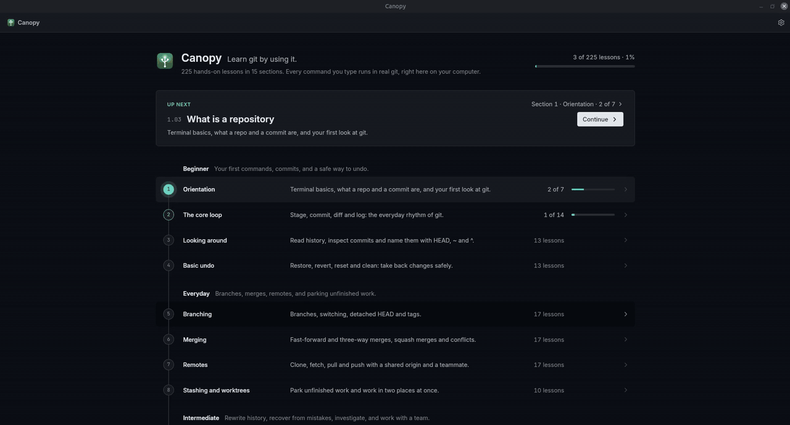
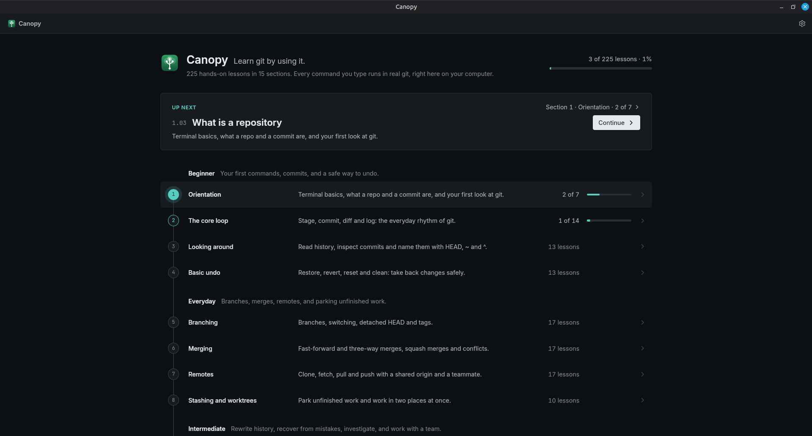
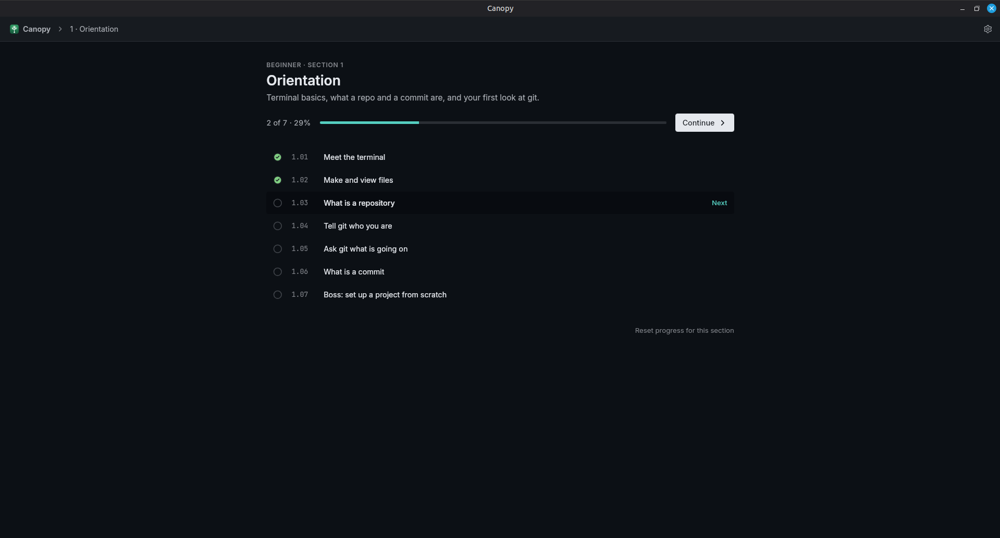
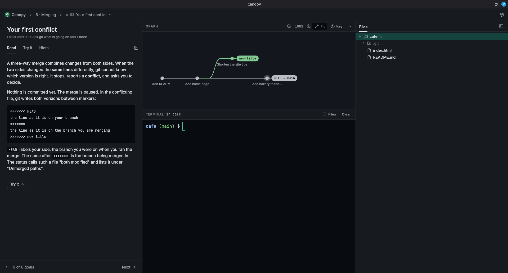
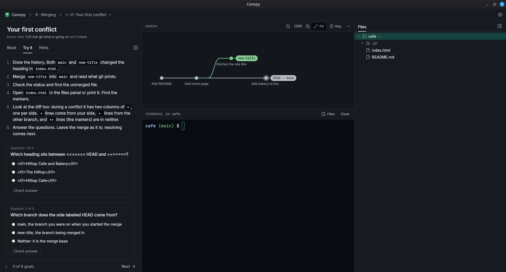
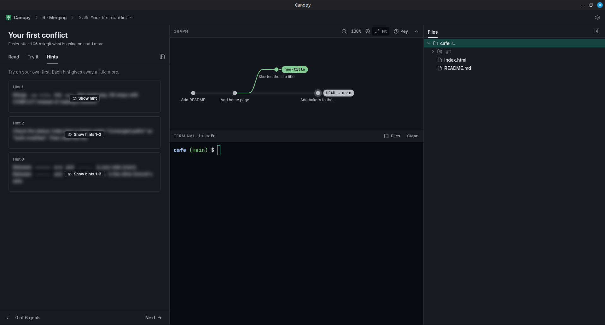
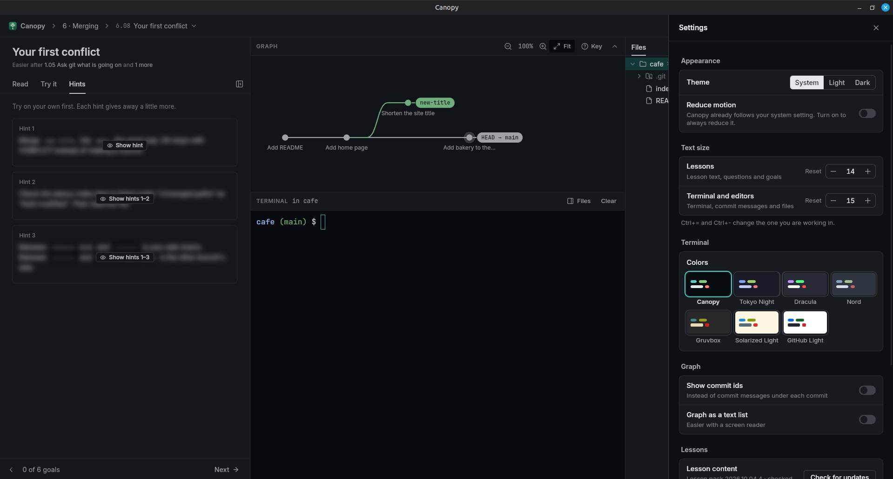

# Canopy

Learn git by using it. A desktop app with a real terminal, a live commit graph and
225 hands-on lessons, from your first `cd` to git internals. Every command you type
runs in real git, inside learning folders Canopy creates; your own projects are never touched.



<details>
<summary>Screenshots</summary>
<br>

| | | |
|:-:|:-:|:-:|
| <a href="assets/screenshots/home.png"></a><br>Home | <a href="assets/screenshots/section.png"></a><br>Section | <a href="assets/screenshots/lesson-read.png"></a><br>Lesson: Read |
| <a href="assets/screenshots/lesson-try.png"></a><br>Lesson: Try it | <a href="assets/screenshots/hints.png"></a><br>Hints | <a href="assets/screenshots/settings.png"></a><br>Settings |

</details>

## Install

Download the installer for your system from the
[latest release](https://github.com/akashvaghela09/canopy/releases/latest).
Canopy needs [git](https://git-scm.com/downloads) 2.32 or newer.

| System | File | Notes |
|---|---|---|
| Linux | `.deb` (Debian, Ubuntu, Mint), `.rpm` (Fedora, openSUSE) or `.AppImage` (any distro) | |
| macOS | `.dmg` (Apple silicon and Intel) | The app is not notarized yet: the first time, right-click Canopy in Applications and choose **Open**. |
| Windows | `.exe` installer or `.msi` | Needs [Git for Windows](https://git-scm.com/download/win), whose Git Bash runs the lessons. The installer is not signed yet: on the SmartScreen prompt choose **More info → Run anyway**. |

No account, no tracking. Canopy goes online only when you press **Check for updates**,
which downloads new or fixed lessons (signed, verified) without a new app release.

## How it works

- **Lessons** have a Read tab (the idea), a Try it tab (steps, questions and goals) and
  Hints that stay blurred until you ask. Goals tick on their own as you work.
- **The terminal** is a real shell in a throwaway folder per lesson. Reset lesson starts over.
- **The graph** draws commits, branches, HEAD, tags, remotes and rewritten history as you
  type; collapse it (Alt+]) or zoom to fit.
- **Your progress** is local. Any lesson can be opened in any order; earlier ones are
  suggested, never required.

| Level | Sections |
|---|---|
| Beginner | Orientation · The core loop · Looking around · Basic undo |
| Everyday | Branching · Merging · Remotes · Stashing and worktrees |
| Intermediate | Rewriting history · Recovery · Detective work · Workflows |
| Advanced | Configuration and productivity · Internals · Specialist tools |

Full curriculum: [`docs/LESSONS.md`](docs/LESSONS.md).

## Development

Rust (stable), Node 22+, pnpm, git 2.32+ and the
[Tauri prerequisites](https://v2.tauri.app/start/prerequisites/) for your system.
On Windows, run the commands below in Git Bash; on macOS, the lesson tests need
GNU sed (`brew install gnu-sed`, then put its `gnubin` folder first on PATH).

```sh
pnpm install
pnpm tauri dev                                  # run the app
cargo test --workspace && pnpm test             # Rust and frontend tests
cargo run -q -p canopy-lesson -- validate       # lesson order and file shape
cargo run -q -p canopy-lesson -- test 6         # run section 6's solutions against their goals
cargo run -q -p canopy-lesson -- test -v 6.08   # one lesson, with the shell transcript
```

| Path | What |
|---|---|
| `crates/canopy-core` | Lesson catalog, setup runner, goal checker, repo snapshots (no UI) |
| `crates/canopy-lesson` | CLI to validate and test lessons |
| `src-tauri` | Tauri backend: PTY shell, SQLite, file watcher, editor bridge, content updates |
| `src` | React + Redux Toolkit + Tailwind v4 frontend; `src/graph` is the commit graph |
| `lessons` | Lesson content ([format](docs/LESSON_FORMAT.md), [updates](docs/CONTENT_UPDATES.md)) |
| `docs` | Architecture, curriculum and design notes |

Releases: bump the version in `package.json`, `src-tauri/tauri.conf.json` and both
`Cargo.toml` files, then push a `v<version>` tag; CI builds every installer.

---

[MIT](LICENSE)
