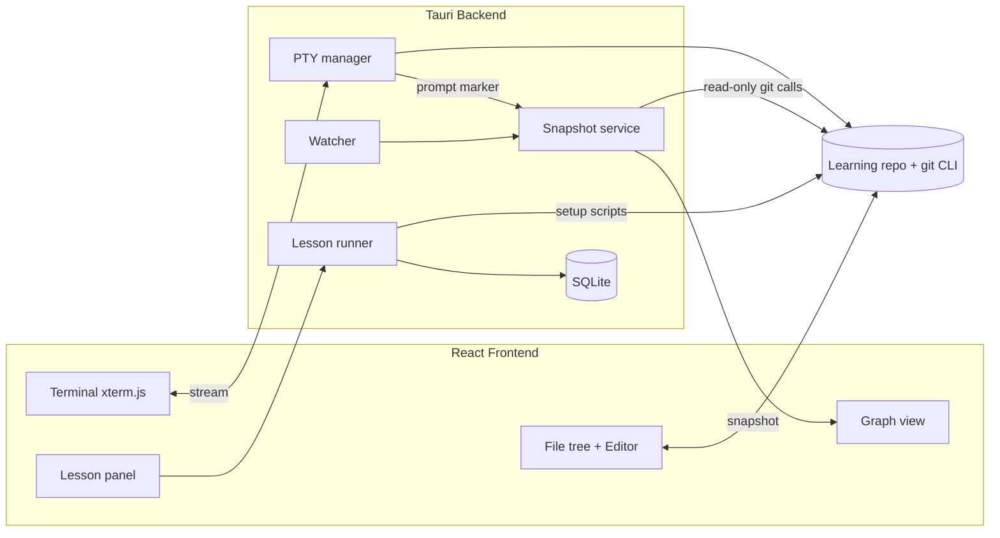

# Git Learning Platform: High-Level Architecture

Status: draft v0.3. Key reference for building the app. Sections 6 and 7 define how people learn and what they learn; the full lesson breakdown (225 lessons) lives in `LESSONS.md`.

## 1. Goal

A desktop app that teaches git by running **real git** in a safe learning folder and showing the result live: terminal, file tree/editor and an animated commit graph on one screen.

**Principles**

1. **Accuracy first.** Every command runs in real git. No simulation, no behavior gaps.
2. **One screen, no distraction.** Terminal, files and graph side by side.
3. **Git is the source of truth.** The app only reads repo state, never keeps its own copy.
4. **Safe by convention.** All work happens in app-created learning repos, never in the user's own projects.
5. **Linux first, then macOS, then Windows.**
6. **Simple progress.** Completion bars per section and overall. No scores, accuracy or mastery tracking.

## 2. Tech Stack

| Layer | Choice | Notes |
|---|---|---|
| Shell | Tauri 2 | Small installers, Rust backend |
| Frontend | React + TypeScript + Vite | |
| Styling | Tailwind CSS v4 | Dynamic colors via CSS variables, not class names |
| State | Zustand (or Redux Toolkit) | Snapshot replaced wholesale per command |
| Terminal UI | xterm.js | |
| PTY | `portable-pty` (Rust) | Real shell, real git |
| Editor | CodeMirror 6 | Lets learners edit files and create conflicts |
| File watching | `notify` (Rust) | Debounced; secondary to prompt marker |
| Graph | Custom SVG (pure layout + thin renderer) | Swappable renderer |
| App database | SQLite via `rusqlite` | Progress, settings, history only |
| Git | System `git` CLI | Version gate on startup |

Verify current crate/package versions before pinning.

## 3. System Overview



## 4. Core Components

### 4.1 PTY manager
- Spawns `bash --noprofile --norc` inside the learning repo.
- Streams output to xterm.js through Tauri channels.
- Injects a prompt hook (`PROMPT_COMMAND`) that prints a hidden marker when a command finishes. This triggers a snapshot at the right moment.
- Keep the hook POSIX-simple so it also works on macOS's older bash.

### 4.2 Snapshot service
Runs read-only git calls after each command and returns one plain object:

```ts
type Snapshot = {
  commits: { id: string; parents: string[]; subject: string; author: string; time: number }[];
  refs: { name: string; target: string; kind: "branch" | "tag" | "remote" }[];
  head: { ref: string | null; commit: string; detached: boolean };
  workingTree: { staged: string[]; modified: string[]; untracked: string[]; conflicted: string[] };
  operation: null | "merge" | "rebase" | "cherry-pick" | "revert" | "bisect";
  index: { path: string; blob: string; stage: number }[];          // staged content (three-area panel, conflicts)
  stashes: { index: number; message: string; base: string }[];
  worktrees: { path: string; head: string; branch: string | null }[];
};
```

Sources: `git log --all --topo-order`, `git for-each-ref`, `git status --porcelain=v2 --branch`, `git ls-files -s`, `git stash list`, `git worktree list --porcelain`, plus checks for `.git/rebase-merge`, `CHERRY_PICK_HEAD`, `MERGE_HEAD`.
Lessons from section 7 on use several repos (origin, the learner's clone, a teammate clone), so a snapshot is taken per repo.
Use `--no-optional-locks` to avoid colliding with the learner's own commands.

### 4.3 Watcher
Debounced fallback that watches the repo, for changes made outside the terminal (e.g. editor saves). The prompt marker is the primary trigger.

### 4.4 Lesson runner
- A lesson = setup script + goal check + text content, plus optional questions and optional hints.
- Setup builds fresh repos in a temp folder with fixed dates and identity, so hashes are identical for every learner.
- Remote lessons (section 7 onward) build `origin.git` (a bare repo), `work/` (the learner's clone) and, where needed, `teammate/`: a second clone driven by a lesson script that runs real git. The script is readable by the learner so nothing is hidden. The runner tracks which repo the terminal is in and which repo the graph shows; origin can be shown side by side.
- Goal checks read the snapshot, file contents, the command log and any answers (see 4.9).
- "Reset lesson" deletes the folder and re-runs setup.
- Each lesson declares `teaches` and `requires` skills (see section 6). They are used to order lessons and to validate prerequisites at build time, not to track the learner.
- Lessons that need an outside tool (`gpg` or `ssh-keygen`, `git subtree`, a merge tool) run a preflight check first and offer a skip or fallback.

### 4.5 Graph (custom)
Three separate stages:

1. **Layout** (pure function, no React): `Snapshot -> { nodes, edges, labels }` with x/y, color and state per node.
2. **Renderer** (thin): draws exactly what layout gives it. SVG first; HTML-plus-SVG-edges or canvas if measurements demand it.
3. **Animation:** diff previous and next layout by node id; animate with CSS transitions on `transform` and `opacity`.

Performance rules: no blur, shadow or gradient on nodes; collapse old history into a single "N earlier commits" node; animate once per command, not per frame.

### 4.6 App database (SQLite)
Stores: lesson completion (lesson id and completed-at time), settings, per-lesson command history for the current attempt, and optional saved snapshots (as JSON text).
Progress percentages are **derived** from the completed set and the lesson index, not stored.
Does **not** store repo state. Lives in the app data directory so "reset lesson" never touches progress. Uses WAL mode and a `schema_version` migration table.

### 4.7 Progress tracking
Deliberately simple: completion only.
- A lesson is **complete** when its goal check passes. A concept lesson is complete when its guided steps or questions are finished.
- **Section progress bar:** completed lessons over total lessons in that section, shown as "N of M" and a percentage.
- **Overall progress:** one bar, percentage and "X of 225 lessons".
- Section state: not started, in progress, complete.
- The home screen also shows the current section and the next lesson.
- Redoing a completed lesson does not change progress. A "reset progress" option exists per section and overall.
- Not tracked: accuracy, attempts, hint use, time spent, per-skill mastery or review schedules.

### 4.8 Lesson UI panels
- **Three-area panel** (working tree, staging, HEAD) for sections 2 and 4; needs `index` data from the snapshot.
- **Question and answer widget** for lessons that check answers ("who changed line 12?").
- **Destructive-action banner** for lessons marked destructive (sections 4, 9, 10).
- **Optional "inside .git" panel** (objects, index, refs) for section 14.
- Lesson text with optional hints that carry no penalty.

### 4.9 Command log and goal checks
- The PTY layer logs each command with its exit code and timestamp for the current lesson attempt. Goals like "used `--no-commit`" are checked against this log.
- Editors route through the app: set both `GIT_EDITOR` and `GIT_SEQUENCE_EDITOR`, so `rebase -i`, commit messages and merge messages open in the in-app editor.

## 5. Visual Language

- **Branch color:** stable hue from a hash of the branch name in OKLCH (fixed lightness and chroma, hues spaced widely). `main` gets a fixed neutral anchor.
- **Commit color:** each commit has one owner: walk first-parent from each branch tip, `main` first; first claimant colors it.
- **Merge commit:** target branch color; incoming edge in the source branch color.
- **Rewritten commits (rebase, cherry-pick, amend):** originals stay in their old color, ghosted and dashed; new copies take the color of the branch they land on.
- **Unreachable commits:** gray.
- **HEAD:** ring or arrow marker, never a color.
- **Accessibility:** color is never the only signal; add labels and line styles.

### Tracking rewritten commits
Git assigns new hashes on rebase and cherry-pick. To animate old to new, match commits using the reflog and/or `git range-diff` / `git cherry` (patch-equivalence). Lessons 11.08 and 15.17 teach the same techniques.

### Visuals required by the curriculum
- **Revert:** a distinct (dashed) link from a revert commit to the commit it undoes.
- **Reset:** the branch label animating backward along existing commits.
- **Remote-tracking flags:** `origin/*` drawn differently from local branches; optionally origin's graph side by side.
- **Cherry-pick and rebase:** ghosted originals, animated copies, and a dotted arrow from original to copy.
- **Merges:** two incoming edges (target color on the lane, source color on the incoming edge); octopus merges with several parents.
- **Tags:** a different shape from branch flags.
- **Detached HEAD:** HEAD pointing directly at a commit, with a warning when commits would become unreachable.
- **Worktrees:** one HEAD marker per worktree.
- **Stashes:** small parked entries off the graph.
- **Reflog:** an optional "ghost trail" overlay showing where HEAD has been.
- **Highlights:** merge base, and the commits selected by range expressions such as `A..B` or `HEAD~3`.

## 6. Learning Methodology

The curriculum is a **spiral**: earlier skills keep reappearing inside newer lessons as real steps, so learners recall commands instead of only reading them. This comes from how lessons are written. The app does not schedule reviews or score the learner.

### 6.1 The two rules

1. **Prerequisites first.** A lesson may only use skills taught earlier. Each lesson declares exactly what it needs; there is no fixed count. A rebase lesson requires cherry-pick, log-range and merge-three-way; interactive rebase requires rebase.
2. **Topics come back over time.** A skill taught earlier is needed again in later lessons (through `requires`) and in each section's boss lesson, which mixes older skills with the new ones.

### 6.2 Lesson metadata

```yaml
id: "9.09"
section: rewriting-history
title: Rebase a branch
teaches: [rebase]
requires: [cherry-pick, log-range, concept-divergence, merge-three-way]
goal: goal.json        # checked against the real repo snapshot
```

- Prerequisites form a **graph**, not a line. A lesson order is any valid path through it.
- Skill ids are used for ordering and for the build-time validator (every `requires` skill must be taught in an earlier lesson). They are not tracked per learner.
- Lesson files are generated from `LESSONS.md`.
- Hints are optional text shown on request. They have no effect on progress.

### 6.3 How recall works

- **No command given for old skills.** New lessons say "create a branch" or "go back one commit"; the learner recalls the command.
- **Natural reuse.** Later lessons need earlier skills as real steps, such as using `branch` and `commit` inside a merge lesson.
- **Boss lessons.** Each section ends with a goals-only challenge mixing that section's skills with older ones.
- **Failure is allowed.** The learner can retry or reset a lesson any number of times. Nothing is recorded as a failure and nothing blocks progress.

### 6.4 Progress

Completion only; see section 4.7.

### 6.5 Lesson writing guidelines

- A recalled skill must be a **real step** in the task, not busywork.
- Keep one clear new idea per lesson; avoid overloading with many old skills at once.
- Every lesson has a checkable goal from the repo snapshot.
- Every topic has **many dedicated lessons**, small steps first, then combined tasks.
- Every lesson lists its `requires` so the validator can check ordering.

## 7. Curriculum

Scope: core git only. Separate tools (Git LFS, `git filter-repo`) are out of scope. Each topic below is broken into individual lessons in `LESSONS.md` (225 lessons in total). Prerequisites between sections follow section 6.

### Beginner

**1. Orientation**
- Terminal basics (`cd`, `ls`, `mkdir`)
- What a repo and a commit are
- `config`, `init`, `status`

**2. The core loop**
- `add`, `commit`, `diff`, `log`
- `.gitignore`, `rm`, `mv`
- The three areas: working tree, staging, HEAD

**3. Looking around**
- `log --oneline --graph --all`, `show`
- `diff` variants, `blame`
- `HEAD`, `^` and `~`, `describe`

**4. Basic undo**
- `restore`, `restore --staged`, `revert`
- `reset --soft`, `--mixed`, `--hard`
- `clean`

### Core

**5. Branching**
- `branch`, `switch`, `checkout`
- Delete and rename branches
- Detached HEAD
- Tags: lightweight and annotated

**6. Merging**
- Fast-forward and three-way merges
- `--no-ff`, `--squash`
- Conflicts and `merge --abort`

**7. Remotes**
- `clone`, `remote`, `fetch`
- `pull` (merge vs rebase)
- `push`, `push -u`, tracking branches
- Deleting remote branches

**8. Stashing and worktrees**
- `stash` (`push`, `pop`, `apply`, `-u`)
- `worktree`

### Intermediate

**9. Rewriting history**
- `commit --amend`
- `rebase`, `rebase --onto`
- `rebase -i`: reword, squash, fixup, edit, drop, reorder
- `--autosquash`
- `cherry-pick`: single commits and ranges
- `--continue`, `--skip`, `--abort`

**10. Recovery**
- `reflog`, `ORIG_HEAD`
- Restoring deleted branches and lost commits
- Dangling commits

**11. Detective work**
- `bisect`
- `log -S`, `-G`, `-L`
- `blame` options, `range-diff`, `shortlog`

**12. Workflows**
- Feature branches, trunk-based, Gitflow
- PR concepts, release tagging
- `--force-with-lease` and force-push safety
- Conflict-avoidance habits

### Advanced

**13. Configuration and productivity**
- Config levels, aliases, hooks
- `.gitattributes`, `rerere`
- Diff and merge tools
- Sparse-checkout, shallow and partial clones

**14. Internals**
- Object types: blob, tree, commit, tag
- Hashes (SHA-1 / SHA-256)
- `hash-object`, `cat-file`, `ls-tree`, `rev-parse`, `update-ref`
- Refs and the DAG
- Packfiles, `gc`, `fsck`

**15. Specialist tools**
- Submodules, subtree
- `format-patch` and `am`
- `bundle`, `archive`, `notes`
- Signed commits
- Merge strategies (`ours`, octopus)
- `maintenance`

### Notes

- **Hardest to teach visually:** sections 9 and 14. Give them the most lessons; graph animation matters most there.
- **Flexible ordering:** stash (8) and reflog (10) may move earlier, since they are common "I broke something" moments.
- **Each section ends with a boss lesson** (section 6.3).
- **Minimum git version:** see the version-sensitive table in `LESSONS.md` (for example `switch` and `restore` need 2.23+, `GIT_CONFIG_GLOBAL` needs 2.32+, `rebase --update-refs` needs about 2.38). Verify against git release notes.

**Lessons per section:** 1: 7, 2: 14, 3: 13, 4: 13, 5: 17, 6: 17, 7: 17, 8: 10, 9: 27, 10: 13, 11: 13, 12: 13, 13: 15, 14: 18, 15: 18.

## 8. Isolation (convenience boundary, not a security jail)

Environment variables on the spawned shell only; the user's system is untouched:

| Variable | Purpose |
|---|---|
| `GIT_CONFIG_GLOBAL=<app gitconfig>` | Ignore user's global config |
| `GIT_CONFIG_NOSYSTEM=1` | Ignore system config |
| `GIT_CEILING_DIRECTORIES=<parent of lessons>` | Never discover real repos upward |
| `GIT_AUTHOR_*`, `GIT_COMMITTER_*` | Fixed identity and dates for deterministic hashes |
| `GIT_PAGER=cat` | No hanging pagers |
| `GIT_EDITOR=<app script>` | Route commit and merge messages to the in-app editor |
| `GIT_SEQUENCE_EDITOR=<app script>` | Route the `rebase -i` todo list to the in-app editor |

The shell starts inside the learning folder. A determined user can still leave it, so do not market it as sandboxed.

Extras from the lesson list:
- The app gitconfig sets `init.defaultBranch=main`.
- It may set `protocol.file.allow=always` so submodule lessons work with local repos (recent git blocks the file protocol for submodules by default). This applies only to the app's isolated config.
- Lessons never run `git maintenance start`, which registers a scheduler job on the learner's system. It is explained but not executed.
- Hooks in lessons are lesson-authored scripts inside the learning folder.

## 9. Platform Strategy

1. **Linux (primary).** Test on X11 and Wayland. WebKitGTK is the weakest webview for heavy animation; keep rendering cheap. Packages: `.deb`, `.rpm`, AppImage.
2. **macOS.** Same Unix PTY path. Needs signing and notarization.
3. **Windows.** Needs Git for Windows (includes bash). ConPTY quirks to prototype before committing to UX. Needs code signing.

**Tool preflight:** some lessons need `gpg` or `ssh-keygen` (signing), `git subtree`, or a merge tool. Each lesson checks first and offers a skip or fallback. SSH signing avoids a GPG dependency.

**Git requirement:** check `git --version` on startup. If missing or too old, show a button linking to https://git-scm.com/downloads and a "Check again" button. The minimum version comes from the version-sensitive table in `LESSONS.md`.

## 10. Suggested Repo Layout

```
/src                  React app
  /graph              layout.ts (pure), renderer, animation
  /terminal           xterm wrapper
  /editor             CodeMirror + file tree
  /lessons-ui         lesson panel, question widget, three-area panel, progress bars
  /store              snapshot + UI state + progress
/src-tauri
  /src/pty.rs
  /src/snapshot.rs
  /src/watcher.rs
  /src/lessons.rs
  /src/db.rs
  /src/preflight.rs
/lessons
  /<lesson-id>/       lesson.yaml (teaches/requires), setup.sh, goal.json, content.md
/tools                validate-lessons (prerequisite check), generate lesson.yaml from LESSONS.md
/docs                 ARCHITECTURE.md, LESSONS.md
```

## 11. Risks

| Risk | Mitigation |
|---|---|
| Linux webview animation performance | Cheap rendering, measure early on real hardware |
| Windows ConPTY quirks | Prototype late but before release; Linux and macOS first |
| `index.lock` collisions | Read-only calls with `--no-optional-locks` |
| Old git on some distros | Version gate and download link |
| Mapping old to new commits after rewrite | Reflog and `range-diff` / `cherry` |
| Learners breaking repos | One-click reset lesson |
| Learner escaping the learning folder | Env isolation, warnings, honest messaging |
| 225 lessons to author and keep consistent | Generate from `LESSONS.md`; validator checks prerequisite order in CI |
| Missing outside tools (gpg, ssh-keygen, git subtree) | Preflight with skip or fallback |
| Version-sensitive lessons on older git | Version table in `LESSONS.md`; show a "needs newer git" notice or mark lessons optional |
| Multi-repo lessons (origin, clone, teammate) | Runner manages several repos; snapshot per repo |

## 12. Decisions

Decided (2026-10-03):
- **Prerequisites are advisory.** Any section and lesson can be opened; a soft "Recommended first" notice lists the lessons that teach missing skills.
- **State: Redux Toolkit.** Stack otherwise as in section 2.
- **Minimum git: 2.32** (`GIT_CONFIG_GLOBAL` / `GIT_CONFIG_SYSTEM`). Lessons above it carry `minGit` and show a "needs newer git" notice with a Skip option.
- **Skip counts as complete** with a "skipped" mark (tool missing, git too old, optional lessons).
- **Concept lessons** complete when their questions are answered (questions are goals).
- **No boss test-out.**
- **Recovery (section 10) stays where it is.**
- **No accounts, no app auto-updater.** Lesson content can be updated manually and safely: see `CONTENT_UPDATES.md`.
- **Themes:** light and dark, default follows the system. UI design: `design/DESIGN.md`.
- **Isolation changes from section 8:** fixed identity and dates apply to lesson setup only, never to the learner's shell; a fallback identity lives in Canopy's private system config; `GIT_CONFIG_SYSTEM` points to a Canopy file instead of `GIT_CONFIG_NOSYSTEM`.
- **License:** MIT.

Still open:
- Packaging and signing pipeline for app installers (macOS notarization, Windows signing).
- Whether to store snapshots for session replay.
