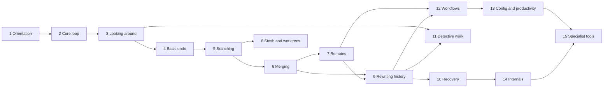

# Lessons: Complete Curriculum (Sections 1 to 15)

Companion to `ARCHITECTURE.md` (sections 6 and 7). This file breaks every curriculum topic into individual lessons: 225 lessons across 15 sections, from first terminal command to git internals. It is the source for generating `lesson.yaml` files.

## Section map

Prerequisites are tracked per skill (below), but at section level the path looks like this:

## How to read this

- **ID** `S.NN`: section number and lesson number.
- **Teaches**: skill ids the lesson introduces. Used for ordering and prerequisite validation; not tracked per learner.
- **Requires**: skills that must already be taught (Rule 1). The learner recalls these without being told the command; hints are optional and carry no penalty.
- **Task**: what the learner does in the terminal.
- **Check**: what the goal checker verifies from the real repo snapshot, file contents or command history.
- **Vis**: what the graph or panels should show for this lesson.
- Skill ids are kebab-case and are used by the build-time prerequisite validator.
- `concept X` in lesson text maps to skill id `concept-X` (for example `concept-commit`). A concept lesson has no single command to check; it is checked by questions or by a guided action.
- Recall (Rule 2) comes from the lessons themselves: "Requires" skills are needed as real steps, and boss lessons mix older skills. The app does not schedule reviews or track mastery.

## Conventions for sections 1 to 4

- Learners work only on the `main` branch. The app's gitconfig sets `init.defaultBranch=main`. The graph shows the branch label moving; full branching starts in section 5.
- Lessons marked **(guided)** show the exact command in the lesson text because the skill is taught properly later.
- Destructive lessons (`restore`, `reset --hard`, `clean`) are flagged **(destructive)**: show a warning, and reset-lesson stays one click away.
- Some lessons in section 3 start from a **pre-built repo** (branches, tags, a merge commit) that the learner only reads; creating those is taught later.
- Every section ends with a **boss lesson** that gives goals, not commands.

---

## Section 1: Orientation

### 1.01 Meet the terminal
- Teaches: `term-navigate` (`pwd`, `ls`, `ls -a`, `cd`, `cd ..`)
- Requires: none
- Task: find where you are, list files, move into a folder and back.
- Check: command history shows the moves; final working directory matches the goal.
- Vis: file tree highlights the current folder.

### 1.02 Make and view files
- Teaches: `term-files` (`mkdir`, `touch`, `echo "text" > file`, `cat`)
- Requires: `term-navigate`
- Task: create a folder and a few files, write text into one, read it back.
- Check: files exist with expected content.

### 1.03 What is a repository
- Teaches: `init`, concept `repo`
- Requires: `term-navigate`, `term-files`
- Task: run `git init` in a new folder; find the hidden `.git` folder with `ls -a`.
- Check: `.git` exists; default branch is `main`.
- Vis: empty graph appears with "no commits yet"; `.git` shown as a special folder.

### 1.04 Tell git who you are
- Teaches: `config-identity` (`config user.name`, `config user.email`, `config --list`, `--global` vs `--local`)
- Requires: `init`
- Task: set name and email; read them back; see which level a value comes from (`--show-origin`).
- Check: values set at the requested level.
- Note: the global level is the app's isolated gitconfig, not the user's real one.

### 1.05 Ask git what is going on
- Teaches: `status`
- Requires: `init`, `term-files`
- Task: run `git status` in an empty repo, add a file, run it again, read "untracked".
- Check: learner names the file git lists as untracked.
- Vis: working-tree panel shows the file as untracked.

### 1.06 What is a commit (guided)
- Teaches: concept `commit` (a snapshot with a message, author, parent)
- Requires: `status`, `config-identity`
- Task: follow the shown commands (`git add .`, `git commit -m "..."`), then inspect the result.
- Check: one commit exists on `main`.
- Vis: first commit dot appears and the `main` label and HEAD attach to it.
- Note: proper `add` and `commit` lessons are in section 2.

### 1.07 Boss: set up a project from scratch
- Requires: all of section 1
- Task (goals only): create a project folder with two files, make it a repo, identify yourself, check status.
- Check: repo exists, identity set locally, status reports expected untracked files.

---

## Section 2: The core loop

### 2.01 Stage a file
- Teaches: `add`, concept `staging-area`
- Requires: `status`, `term-files`, concept `commit`
- Task: stage one of several new files; read status.
- Check: only that file is staged.
- Vis: three-area panel (working tree, staging, HEAD) with the file moving between areas.

### 2.02 Commit what is staged
- Teaches: `commit` (`commit -m`)
- Requires: `add`, `config-identity`
- Task: commit the staged file only; others stay untracked.
- Check: commit contains exactly the staged file.

### 2.03 Staged vs changed-after-staging
- Teaches: concept `three-areas`
- Requires: `add`, `commit`, `status`
- Task: stage a file, edit it again, read status showing it in both staged and modified; decide what to add.
- Check: commit contains the version the goal specifies.
- Vis: the panel shows two different versions of one file.

### 2.04 Stage many files
- Teaches: `add-patterns` (`add .`, `add -A`, `add -u`, `add <dir>`)
- Requires: `add`, `commit`, `status`
- Task: new, modified and deleted files; stage them with the right form.
- Check: staged set matches the goal. (Explain the differences: `-u` ignores new files; `-A` covers the whole tree.)
- Note: staging part of a file (`add -p`) comes later, in 9.19.

### 2.05 Write a good commit message
- Teaches: `commit-message` (subject and body, multiple `-m`, imperative style)
- Requires: `commit`
- Task: write a commit with a subject and a body.
- Check: subject length and a non-empty body.
- Note: checks conventions lightly; do not over-police style.

### 2.06 Skip the staging step
- Teaches: `commit-a` (`commit -a`, what it does not cover: untracked files)
- Requires: `commit`, `add-patterns`
- Task: modify tracked files, add a new file, commit with `-a`; notice the new file is left out.
- Check: commit has tracked changes only; new file still untracked.

### 2.07 See what changed
- Teaches: `diff` (unstaged changes)
- Requires: `status`, concept `three-areas`
- Task: modify files, read `git diff`, answer questions about specific lines.
- Check: learner's answers match the diff.
- Vis: diff panel with added and removed lines.

### 2.08 See what is staged
- Teaches: `diff-staged` (`diff --staged` / `--cached`)
- Requires: `diff`, `add`
- Task: compare `diff` and `diff --staged` for a half-staged file.
- Check: correct answers on which changes are in which view.

### 2.09 Read the history
- Teaches: `log`
- Requires: `commit`
- Task: make several commits, read `git log`, answer questions (who, when, what message).
- Check: answers match the repo.

### 2.10 Tell git what to ignore
- Teaches: `gitignore` (patterns, folders, `!` negation, ignored files stay out of status)
- Requires: `status`, `add-patterns`, `term-files`
- Task: create build output and log files; ignore them with `.gitignore`; commit the file.
- Check: ignored files absent from status; `.gitignore` committed.
- Note: later add a variant for "already tracked files are not ignored".

### 2.11 Remove files
- Teaches: `rm` (`git rm`, `git rm --cached`)
- Requires: `commit`, `status`
- Task: delete a file and commit; untrack a file but keep it on disk.
- Check: file gone from the next commit; for `--cached`, still on disk but untracked.

### 2.12 Move and rename files
- Teaches: `mv` (`git mv`; plain `mv` plus staging produces the same result)
- Requires: `rm`, `add`
- Task: rename a file two ways; check both appear as a rename in status.
- Check: next commit records a rename.

### 2.13 Read status in short form
- Teaches: `status-short` (`status -s`, `-sb`, reading the two status columns)
- Requires: `status`, concept `three-areas`
- Task: interpret short output for a mixed repo, then reproduce a given short status.
- Check: learner's reproduced state matches.

### 2.14 Boss: build a small project history
- Requires: all of section 2
- Task (goals only): produce a history of at least four meaningful commits with a clean `.gitignore`, one rename and one removal.
- Check: graph and file checks from the snapshot.

---

## Section 3: Looking around

### 3.01 Compact history
- Teaches: `log-oneline` (`log --oneline`, `-n`)
- Requires: `log`
- Task: show a long history briefly; limit to the last N commits.
- Check: command history matches goal and answers are correct.

### 3.02 See the shape of history
- Teaches: `log-graph` (`--graph --all --decorate`)
- Requires: `log-oneline`
- Task: read a pre-built repo's graph; identify branch tips, merges, HEAD.
- Check: answers match the repo.
- Vis: show terminal ASCII graph next to the app's graph, so the two are linked visually.

### 3.03 Filter history by who, when and what
- Teaches: `log-filter` (`--author`, `--since`, `--until`, `--grep`)
- Requires: `log-oneline`
- Task: find commits by author, date range and message text in a pre-built repo.
- Check: learner reports the right set.

### 3.04 History of one file
- Teaches: `log-path` (`log -- <path>`, `--stat`, `-p`, `--follow` for renames)
- Requires: `log-filter`
- Task: find every commit touching one file, see its patch, follow it across a rename.
- Check: answers match.

### 3.05 Inspect one commit
- Teaches: `show` (`show <commit>`, `--stat`, `<commit>:<path>`)
- Requires: `log-oneline`
- Task: read a commit's changes; view a file as it was in an old commit.
- Check: answers match.

### 3.06 Commit ids
- Teaches: concept `commit-id` (full vs abbreviated hash, why short ids can work)
- Requires: `show`
- Task: use short ids with `show`; find the shortest unambiguous prefix in the repo.
- Check: command history shows short ids used correctly.

### 3.07 What is HEAD
- Teaches: `head` (concept; `show HEAD`, `log -1`)
- Requires: `show`, `log-graph`
- Task: find what HEAD points to; make a commit and watch it move.
- Check: answers match; HEAD moved.
- Vis: HEAD marker animates on each new commit.

### 3.08 Relative references
- Teaches: `relative-refs` (`HEAD~1`, `HEAD~3`, `HEAD^`, `HEAD^2` on a merge commit)
- Requires: `head`, `show`
- Task: reach a given commit by relative reference; explain `~` vs `^` on a merge.
- Check: the right commit is shown for each target.
- Vis: highlights the commit each expression resolves to.

### 3.09 Compare two commits
- Teaches: `diff-commits` (`diff A B`, `diff A..B`, `diff HEAD~2 HEAD`)
- Requires: `diff`, `relative-refs`
- Task: see what changed between two points in history.
- Check: learner picks the right changes.

### 3.10 Diff options
- Teaches: `diff-options` (`--stat`, `--name-only`, `--name-status`, `-w`, `--color-words`)
- Requires: `diff-commits`
- Task: answer questions that need the right option (which files changed? which only by whitespace?).
- Check: answers match.

### 3.11 Who changed this line
- Teaches: `blame` (`blame <file>`, `-L`)
- Requires: `show`, `log-path`
- Task: find who last changed a given line and open that commit.
- Check: correct commit identified.

### 3.12 Name a commit by its nearest tag
- Teaches: `describe`
- Requires: `log-graph`, `relative-refs`
- Task: on a pre-built repo with annotated tags, read `git describe` output and explain each part.
- Check: answers match.
- Note: tags are created in section 5; this lesson only reads them.

### 3.13 Boss: investigate a mystery repo
- Requires: all of section 3
- Task (goals only): answer questions about a pre-built repo: who introduced a bug, what changed between two releases, which file was renamed, what HEAD~4 contained.
- Check: all answers correct.

---

## Section 4: Basic undo

### 4.01 Discard changes in a file (destructive)
- Teaches: `restore` (`restore <file>`)
- Requires: `status`, `diff`
- Task: throw away uncommitted edits to one file.
- Check: file matches HEAD; other edits untouched.

### 4.02 Unstage a file
- Teaches: `restore-staged` (`restore --staged <file>`)
- Requires: `add`, `diff-staged`
- Task: unstage a file but keep its edits.
- Check: file modified but not staged.

### 4.03 Bring back an old version of a file
- Teaches: `restore-source` (`restore --source=<commit> <file>`)
- Requires: `restore`, `relative-refs`, `show`
- Task: restore a file from an older commit, then commit.
- Check: file content matches the old version.

### 4.04 Revert a commit
- Teaches: `revert` (concept: undo by adding a new commit)
- Requires: `commit`, `relative-refs`, `log`
- Task: undo a specific past commit without rewriting history.
- Check: a new revert commit exists; history intact; file contents back.
- Vis: new commit with a dashed link to the one it reverts.

### 4.05 Revert in more detail
- Teaches: `revert-options` (`--no-edit`, `--no-commit`, reverting several commits)
- Requires: `revert`
- Task: revert a range as one commit; revert and edit before committing.
- Check: result matches the goal.

### 4.06 What reset really does
- Teaches: concept `reset` (moves the current branch label; `main` moves, files may or may not change)
- Requires: `head`, concept `three-areas`, `log-graph`
- Task: guided exploration with the graph showing the branch label move.
- Check: answers match.
- Vis: branch label animates backward; HEAD and the three areas shown.
- Note: forward pointer to remotes: why reset is risky on shared history (covered in section 7).

### 4.07 Reset softly (destructive to history only)
- Teaches: `reset-soft` (`reset --soft HEAD~N`)
- Requires: concept `reset`, `relative-refs`
- Task: undo the last two commits but keep all changes staged; recommit them as one.
- Check: one new commit with combined changes.

### 4.08 Reset mixed
- Teaches: `reset-mixed` (`reset`, `reset --mixed`, default behavior)
- Requires: `reset-soft`
- Task: undo a commit and keep changes unstaged; restage selectively.
- Check: working tree retains edits; staging empty.

### 4.09 Reset hard (destructive)
- Teaches: `reset-hard`
- Requires: `reset-mixed`
- Task: throw away commits and edits to return to a known state.
- Check: HEAD, staging and files all match the target.
- Note: add a safety banner; recovery is taught in section 10.

### 4.10 Reset one file
- Teaches: `reset-path` (`reset <file>`; same effect as `restore --staged`)
- Requires: `reset-mixed`, `restore-staged`
- Task: unstage a file using `reset`; explain why it does not move the branch.
- Check: goal state matches.

### 4.11 Clean untracked files (destructive)
- Teaches: `clean` (`clean -n`, `-f`, `-d`, `-x`)
- Requires: `status`, `gitignore`
- Task: preview first with `-n`, then remove untracked files and folders; leave ignored files unless `-x`.
- Check: only the expected files removed.
- Note: teach dry-run first as a habit.

### 4.12 Choose the right undo
- Teaches: `undo-decision`
- Requires: `restore`, `restore-staged`, `revert`, `reset-soft`, `reset-hard`, `clean`
- Task: several scenarios ("I committed the wrong file", "I want to remove a commit others have", "I want to drop all edits"); pick and run the right approach for each.
- Check: each scenario's end state matches the goal.

### 4.13 Boss: rescue a messy repo
- Requires: all of section 4
- Task (goals only): a pre-built repo with a bad commit, staged junk, untracked clutter and an edit to throw away; reach a clean target state.
- Check: final snapshot matches target.

---

---

## Conventions for sections 5 to 15

- **Version-sensitive** lessons are flagged and listed at the end of the file, so the minimum git version can be chosen from facts.
- **Remote lessons** (sections 7, 12, 15) use a local bare repo as `origin`, the learner's clone, and a **teammate clone** driven by a lesson-provided script. The script runs real git, and the learner can read it. No network is needed.
- **Tool preflight:** lessons that need an outside tool (gpg or `ssh-keygen`, `git subtree`, an editor) check for it first and offer a skip or fallback.
- **Sandbox-safe:** commands that would change the learner's system outside the learning folder (for example `git maintenance start`, which registers a scheduler job) are explained but not run.
- **Validation:** a build-time check fails if any `requires` skill is not taught in an earlier lesson.
- **Boss lessons** list goals, not commands, and mix the section's skills with older ones from earlier sections.

---

## Section 5: Branching

Setup: small repos with a few commits on `main`. This section introduces diverging history and the first branch colors in the graph.

### 5.01 What a branch is
- Teaches: concept `branch`, `branch-list` (`branch`, `branch -v`, `branch --show-current`)
- Requires: `head`, `log-graph`, concept `reset`
- Task: read the graph, name the current branch, list branches, explain what a branch label points to.
- Check: answers match the repo.
- Vis: draw the chain HEAD → branch → commit explicitly; branch labels as colored flags.

### 5.02 Create a branch
- Teaches: `branch-create` (`branch <name>`, `branch <name> <start>`, names with slashes, invalid names)
- Requires: `branch-list`, `commit`
- Task: create a branch at HEAD and another at an older commit; notice HEAD did not move.
- Check: branches exist at the expected commits; current branch unchanged.

### 5.03 Switch branches
- Teaches: `switch` (`switch <branch>`, `switch -`)
- Requires: `branch-create`, `status`
- Task: switch between branches; watch files change on disk; jump back with `-`.
- Check: current branch and file contents match the goal.
- Vis: HEAD marker moves from one branch flag to another; no commit moves.

### 5.04 Create and switch in one step
- Teaches: `switch-create` (`switch -c <name>`, `switch -c <name> <start>`)
- Requires: `switch`
- Task: start a new branch from the current commit and from an older one.
- Check: branch at the right commit and checked out.

### 5.05 Commit on a branch
- Teaches: concept `divergence`
- Requires: `switch-create`, `commit`, `log-graph`
- Task: commit on a feature branch, switch to `main`, commit there too; read the forked graph.
- Check: each branch has a unique commit; the graph shows a fork.
- Vis: history forks into two colored lanes.

### 5.06 checkout, the older command
- Teaches: `checkout` (`checkout <branch>`, `checkout -b`, `checkout <commit>`, `checkout -- <file>`)
- Requires: `switch`, `restore`
- Task: repeat switch and restore tasks using `checkout`; map each old form to `switch` or `restore`.
- Check: command history uses the checkout forms; end state correct.
- Note: explain why `switch` and `restore` were split out of `checkout`.

### 5.07 Switching with uncommitted changes
- Teaches: concept `switch-dirty` (changes travel along when safe; git refuses when they would be overwritten; `--discard-changes`, `--merge`)
- Requires: `switch`, `status`, `restore`
- Task: three scenarios: an edit that travels, an edit git blocks, and a safe fix (commit or restore).
- Check: each scenario ends in the target state.

### 5.08 Compare branches by commits
- Teaches: `log-range` (`log A..B`, `log B..A`, `log A...B --left-right`)
- Requires: `log-graph`, `diff-commits`, `branch-list`
- Task: list commits only on one branch; list commits on either side but not both.
- Check: learner's lists match the repo.
- Vis: highlight the commits each range expression selects.

### 5.09 Merged or not
- Teaches: `branch-merged` (`branch --merged`, `--no-merged`, `merge-base A B`, `diff A...B`)
- Requires: `log-range`, `diff-options`
- Task: find which branches are fully merged, find the common ancestor, see only a branch's own changes.
- Check: answers match.
- Vis: merge base highlighted on the graph.

### 5.10 Rename a branch
- Teaches: `branch-rename` (`branch -m`, `-M`)
- Requires: `branch-create`, `switch`
- Task: rename the current branch and another branch.
- Check: names changed; commits unchanged.

### 5.11 Delete a branch
- Teaches: `branch-delete` (`branch -d`, `-D`, why git refuses unmerged branches)
- Requires: `branch-merged`
- Task: delete a merged branch; try an unmerged one and read the refusal; force when truly intended.
- Check: expected branches remain.
- Note: stress that the commits are not deleted, only the label; recovery comes in section 10.

### 5.12 Peek inside .git: a branch is a file
- Teaches: concept `refs-files` (`cat .git/HEAD`, `ls .git/refs/heads`, `cat .git/refs/heads/<name>`)
- Requires: `branch-create`, `head`
- Task: find where a branch name and its commit id are stored; watch the file change on a commit.
- Check: answers match.
- Note: mention that refs may be packed into `packed-refs` after `gc`.

### 5.13 Detached HEAD
- Teaches: `detached-head` (`switch --detach <commit>`, `checkout <commit>`, committing while detached, saving work with `switch -c`)
- Requires: `switch`, `head`, `relative-refs`, `switch-create`, `log-graph`
- Task: visit an old commit, look around, make a commit, then save it on a new branch.
- Check: the commit is reachable from a named branch.
- Vis: HEAD points directly at a commit, not a branch flag; warn when commits would be unreachable.

### 5.14 Lightweight tags
- Teaches: `tag-lightweight` (`tag <name>`, `tag -l '<pattern>'`, `tag <name> <commit>`, `show <tag>`)
- Requires: `head`, `show`, `describe`, `relative-refs`
- Task: tag the current commit and an older one; list and filter tags.
- Check: tags exist at the right commits.
- Vis: tags drawn as a different shape from branches.

### 5.15 Annotated tags
- Teaches: `tag-annotated` (`tag -a -m`, difference from lightweight, `show` on a tag, `describe` output)
- Requires: `tag-lightweight`, `commit-message`
- Task: create an annotated release tag; compare `show` output with a lightweight tag.
- Check: tag is annotated with the given message.

### 5.16 Move and delete tags
- Teaches: `tag-manage` (`tag -d`, `tag -f`, why moving published tags is discouraged)
- Requires: `tag-annotated`
- Task: delete a mistaken tag; retag the correct commit.
- Check: tag set matches the goal.

### 5.17 Boss: parallel work
- Requires: all of section 5
- Task (goals only): create three branches from different points, commit on each, tag a release, rename one, delete the finished one, and end on a given branch.
- Check: branch, tag and HEAD state match the target.

---

## Section 6: Merging

Setup: repos with diverged branches. The graph shows merge commits with two incoming edges: the target branch color on the main lane, the source branch color on the incoming edge.

### 6.01 Merge, fast-forward
- Teaches: concept `merge`, `merge-ff` (`merge <branch>`, fast-forward)
- Requires: `log-range`, `branch-merged`, `switch`, concept `divergence`
- Task: merge a branch that is strictly ahead of `main`; confirm no new commit was made.
- Check: `main` points at the feature tip.
- Vis: the `main` label slides forward along existing commits.

### 6.02 Three-way merge
- Teaches: `merge-three-way` (merge commit with two parents, merge base)
- Requires: `merge-ff`, concept `divergence`, `relative-refs`
- Task: merge diverged branches; find the two parents with `HEAD^1` and `HEAD^2`; identify the merge base.
- Check: merge commit exists with the expected parents.
- Vis: new commit with two incoming edges.

### 6.03 Merge commit messages
- Teaches: `merge-message` (`merge -m`, `--no-edit`, `--edit`)
- Requires: `merge-three-way`, `commit-message`
- Task: merge with a custom message; merge accepting the default.
- Check: messages match the goal.
- Note: the in-app editor handles the message editor.

### 6.04 Force a merge commit
- Teaches: `merge-no-ff` (`merge --no-ff`)
- Requires: `merge-ff`, `merge-message`
- Task: merge a fast-forwardable branch while keeping a merge commit; compare graphs.
- Check: a merge commit exists even though fast-forward was possible.

### 6.05 Refuse non-trivial merges
- Teaches: `merge-ff-only` (`merge --ff-only`)
- Requires: `merge-three-way`
- Task: try `--ff-only` on diverged and on linear branches; read the refusal.
- Check: end state matches the goal.

### 6.06 Squash merge
- Teaches: `merge-squash` (`merge --squash`, then `commit`)
- Requires: `merge-three-way`, `reset-soft`, `branch-delete`
- Task: squash three feature commits into one on `main`; then try to delete the branch and see why git calls it unmerged.
- Check: one new commit with the combined changes and no link to the branch.
- Vis: no incoming edge, unlike a merge commit.

### 6.07 Read merges in history
- Teaches: `log-merges` (`log --first-parent`, `--merges`, `--no-merges`)
- Requires: `log-graph`, `merge-three-way`, `log-filter`
- Task: answer questions about a busy history using the right filters.
- Check: answers match.

### 6.08 Your first conflict
- Teaches: `conflict-read` (conflict markers, "both modified" in status)
- Requires: `merge-three-way`, `status`, `diff`
- Task: trigger a conflict; identify both sides in the markers and which branch each came from.
- Check: answers match.
- Vis: three-way view: ours, theirs, merge base.

### 6.09 Resolve a conflict
- Teaches: `conflict-resolve` (edit, `add`, `commit` or `merge --continue`)
- Requires: `conflict-read`, `add`, `commit`
- Task: resolve a one-file conflict keeping the content the goal specifies.
- Check: merge commit exists; file has no markers; content matches.

### 6.10 Abort a merge
- Teaches: `merge-abort` (`merge --abort`)
- Requires: `conflict-read`
- Task: start a conflicting merge and back out cleanly.
- Check: repo back to its pre-merge state.

### 6.11 Choose a side, and unusual conflicts
- Teaches: `conflict-ours-theirs` (`restore --ours/--theirs`, `checkout --ours/--theirs`, delete/modify conflicts, both-added files)
- Requires: `conflict-resolve`, `rm`, `restore`
- Task: resolve several files: take ours, take theirs, keep a deleted file, accept a deletion.
- Check: each file's final state matches.

### 6.12 Inspect a merge in progress
- Teaches: `merge-state` (`ls-files -u`, `diff --name-only --diff-filter=U`, `log --merge`, `.git/MERGE_HEAD`)
- Requires: `conflict-resolve`, concept `refs-files`
- Task: list unresolved paths, see commits involved, find the other side's commit.
- Check: answers match.

### 6.13 See the common ancestor in conflicts
- Teaches: `conflict-diff3` (`merge.conflictstyle`, `checkout --conflict=diff3 <file>`) (version-sensitive for `zdiff3`)
- Requires: `conflict-resolve`, `config-identity`
- Task: re-create markers with the base section and use it to resolve a tricky conflict.
- Check: resolved content matches.

### 6.14 Undo a local merge
- Teaches: `merge-undo-reset` (`reset --hard HEAD~1` for a true merge commit)
- Requires: `merge-three-way`, `reset-hard`, `relative-refs`
- Task: undo a merge that has not been shared.
- Check: branch back at its pre-merge commit.
- Note: warn that this only works for a merge commit, not a fast-forward; the safer general method comes in 10.04.

### 6.15 Revert a merge commit
- Teaches: `revert-merge` (`revert -m 1 <merge>`, the "merge again brings nothing" trap)
- Requires: `revert`, `merge-three-way`, `log-merges`
- Task: revert a merge that was already shared; merge the branch again and see nothing arrives; revert the revert.
- Check: file content ends at the target state.

### 6.16 Merge options
- Teaches: `merge-options` (`-X ours`, `-X theirs`, `-X ignore-space-change`, `--no-commit`)
- Requires: `conflict-ours-theirs`, `merge-three-way`
- Task: merge favoring one side only for conflicting hunks; preview a merge before committing.
- Check: result matches; explain the difference between `-X ours` and checking out `--ours`.

### 6.17 Boss: integrate three features
- Requires: all of section 6
- Task (goals only): merge three feature branches into `main`, one fast-forward, one with a conflict, one squashed; then undo one of them.
- Check: final tree and history shape match the target.

---

## Section 7: Remotes

Setup: each lesson builds `origin.git` (a bare repo), `work/` (the learner's clone) and, where needed, `teammate/` (a second clone driven by a lesson script that runs real git). No network is involved. The graph shows remote-tracking branches such as `origin/main` in a distinct style.

### 7.01 Clone a repository
- Teaches: `clone` (`clone <path-or-url>`, `clone <url> <dir>`, `clone -b <branch>`), concept `remote`
- Requires: `init`, `log-graph`, `branch-list`, `term-navigate`
- Task: clone the lesson origin; look at what the clone created.
- Check: clone exists with full history.
- Vis: two repos side by side, origin and clone.

### 7.02 Look at the remote
- Teaches: `remote-inspect` (`remote -v`, `remote show origin`, `branch -r`, `branch -a`, `ls-remote`)
- Requires: `clone`
- Task: find the remote URL, its branches, and what a remote has without fetching.
- Check: answers match.

### 7.03 Remote-tracking branches
- Teaches: concept `remote-tracking` (`origin/main` is your bookmark of the remote, read-only, updated only by fetch)
- Requires: `remote-inspect`, concept `branch`, `log-graph`
- Task: explain why `origin/main` and `main` can differ; try committing "on" `origin/main` and see what git does.
- Check: answers match.
- Vis: `origin/*` flags drawn differently from local branches.

### 7.04 Fetch
- Teaches: `fetch` (`fetch`, `fetch --all`, `fetch --prune`)
- Requires: concept `remote-tracking`, `log-range`
- Task: the teammate pushes; fetch; compare `main..origin/main`; see local `main` did not move.
- Check: `origin/main` updated, `main` unchanged.

### 7.05 Bring fetched work into your branch
- Teaches: `integrate-fetched` (`merge origin/main`, fast-forward and three-way)
- Requires: `fetch`, `merge-ff`, `merge-three-way`
- Task: integrate teammate work after fetching, in both a fast-forward and a diverged case.
- Check: `main` contains the teammate's commits.

### 7.06 Pull
- Teaches: `pull` (`pull` as fetch plus merge)
- Requires: `fetch`, `integrate-fetched`
- Task: do the same integration with one command and compare with the two-step way.
- Check: same end state as fetch plus merge.

### 7.07 Push
- Teaches: `push` (`push`, `push origin <branch>`)
- Requires: `commit`, `remote-inspect`, `pull`
- Task: commit and push to origin; verify the teammate sees it.
- Check: origin has the new commit.

### 7.08 Rejected push
- Teaches: `push-rejected` (non-fast-forward rejection, fix by integrating then pushing)
- Requires: `push`, `pull`, `merge-three-way`
- Task: the teammate pushed first; read the rejection; integrate and push.
- Check: origin contains both histories; no force used.

### 7.09 Upstream branches
- Teaches: `upstream` (`branch -vv`, `branch --set-upstream-to`, `@{u}`, `log @{u}..`, ahead and behind in `status -sb`)
- Requires: `push`, `switch`, concept `remote-tracking`, `status-short`
- Task: read ahead/behind counts; set an upstream; compare against it.
- Check: upstream set; answers match.

### 7.10 Push a new branch
- Teaches: `push-branch` (`push -u origin <branch>`)
- Requires: `upstream`, `switch-create`
- Task: create a branch, publish it, and confirm tracking is set.
- Check: branch exists on origin with upstream configured.

### 7.11 Get a teammate's branch
- Teaches: `switch-remote-branch` (`switch <name>` creating a tracking branch, `switch --track`, `switch -c <name> origin/<name>`)
- Requires: `upstream`, `switch-create`
- Task: the teammate publishes a branch; fetch and start working on it.
- Check: local tracking branch exists at the right commit.

### 7.12 Pull safely
- Teaches: `pull-ff-only` (`pull --ff-only`, `pull.ff`)
- Requires: `pull`, `merge-ff-only`
- Task: pull when fast-forward is possible and when it is not; see the refusal and decide how to proceed.
- Check: end state correct, no accidental merge commit.
- Note: `pull --rebase` is taught in 9.25, after rebase.

### 7.13 Delete a remote branch
- Teaches: `push-delete` (`push origin --delete <branch>`, `fetch --prune`, `branch -dr`)
- Requires: `push-branch`, `branch-delete`, `fetch`
- Task: delete a finished branch on origin; clean stale tracking branches locally.
- Check: gone from origin and from `branch -r`.

### 7.14 Manage remotes
- Teaches: `remote-manage` (`remote add`, `rename`, `remove`, `set-url`, `get-url`; `origin` is just a name)
- Requires: `remote-inspect`, `fetch`
- Task: add a second remote, fetch from it, rename and remove it.
- Check: remote list matches the goal.

### 7.15 Push and fetch tags
- Teaches: `push-tags` (`push origin <tag>`, `push --tags`, `push --follow-tags`, `fetch --tags`, deleting a remote tag)
- Requires: `push`, `tag-annotated`
- Task: publish a release tag; the teammate fetches it; remove a wrong remote tag.
- Check: tags on origin match the goal.

### 7.16 The sync routine
- Teaches: `sync-cycle` (commit, fetch, inspect, integrate, push)
- Requires: `pull`, `push`, `push-rejected`, `status-short`
- Task: repeat a full cycle while the teammate keeps pushing.
- Check: final histories on origin and in the clone match the goal.

### 7.17 Boss: collaborate
- Requires: all of section 7
- Task (goals only): clone, branch, publish, receive a teammate's change, resolve a conflict, push, tag a release, delete the branch on origin.
- Check: origin state matches the target.

---

## Section 8: Stashing and worktrees

Setup: repos with dirty working trees and urgent side tasks.

### 8.01 Park your work
- Teaches: `stash-push` (`stash`, `stash push`)
- Requires: concept `switch-dirty`, `status`
- Task: switch is blocked by edits; stash them, switch, come back.
- Check: working tree clean after stashing; stash exists.
- Vis: a stash shown as a small parked entry off the graph.

### 8.02 Look at your stashes
- Teaches: `stash-inspect` (`stash list`, `stash show`, `stash show -p`)
- Requires: `stash-push`
- Task: identify which of several stashes contains a given change.
- Check: correct stash named.

### 8.03 Bring a stash back
- Teaches: `stash-pop-apply` (`stash pop`, `stash apply`, `stash drop`, `stash clear`)
- Requires: `stash-push`, `stash-inspect`
- Task: restore with `apply` and keep the stash; restore with `pop` and drop it.
- Check: working tree matches; stash list matches.

### 8.04 Name stashes and stash by path
- Teaches: `stash-message-path` (`stash push -m`, `stash push -- <path>`)
- Requires: `stash-pop-apply`
- Task: stash only some files with a description.
- Check: only those files stashed; message set.

### 8.05 Untracked and ignored files
- Teaches: `stash-untracked` (`-u`, `--all`, `--keep-index`)
- Requires: `stash-message-path`, `gitignore`
- Task: stash a tree with new files; test staged changes alone with `--keep-index`.
- Check: expected files stashed and kept.

### 8.06 When a stash conflicts
- Teaches: `stash-conflict`
- Requires: `stash-pop-apply`, `conflict-resolve`
- Task: pop onto changed code; resolve; confirm what happens to the stash entry.
- Check: conflict resolved; stash list matches expectation.

### 8.07 Stash into a new branch
- Teaches: `stash-branch` (`stash branch <name>`)
- Requires: `switch-create`, `stash-pop-apply`
- Task: turn an old stash into a branch from the commit it was made on.
- Check: branch exists with the stashed changes applied.

### 8.08 Work in two places at once
- Teaches: `worktree-add` (`worktree add <path> <branch>`, `worktree add -b`, `worktree list`)
- Requires: `branch-create`, `switch`, `term-navigate`
- Task: open a second working directory for a hotfix branch; commit there; return.
- Check: both worktrees exist; commit on the hotfix branch.
- Vis: HEAD shown per worktree.

### 8.09 Manage worktrees
- Teaches: `worktree-manage` (`worktree remove`, `prune`, `move`, `lock`; one branch cannot be checked out twice)
- Requires: `worktree-add`
- Task: try to check out the same branch twice; remove a worktree; prune a deleted one.
- Check: worktree list matches the goal.

### 8.10 Boss: urgent hotfix
- Requires: all of section 8
- Task (goals only): half-finished feature work, an urgent bug; fix and commit the bug without losing or committing the feature work, using stash or worktree.
- Check: both lines of work intact; hotfix committed.

---
## Section 9: Rewriting history

The hardest section to teach and the most important for the graph animation. Whenever a commit is copied, the old commit is ghosted (dashed, in its old branch color) and the new copy slides onto its new base, with a badge. The app maps old to new using the reflog and `range-diff` / `git cherry`. The golden rule is repeated throughout: do not rewrite commits that others already have.

### 9.01 Why history can be rewritten
- Teaches: concept `rewrite` (commits are immutable; "changing" one creates a new commit with a new id)
- Requires: concept `reset`, concept `commit-id`, `log-graph`, `revert`
- Task: guided demonstration with ids shown before and after; answer why the id changed.
- Check: answers match.
- Vis: original ghosted, replacement solid.

### 9.02 Fix the last commit message
- Teaches: `amend-message` (`commit --amend`, `commit --amend -m`)
- Requires: `commit`, `commit-message`, concept `rewrite`
- Task: correct a typo in the last message; compare ids.
- Check: message fixed; id changed; parent unchanged.

### 9.03 Add to the last commit
- Teaches: `amend-content` (`commit --amend --no-edit`, `--reset-author`, `--date`)
- Requires: `amend-message`, `add`
- Task: add a forgotten file to the last commit without changing its message.
- Check: one commit contains the file; message unchanged.

### 9.04 Cherry-pick a commit
- Teaches: `cherry-pick` (`cherry-pick <commit>`; the copy has a new id)
- Requires: `switch`, `show`, concept `rewrite`, concept `commit-id`
- Task: copy one commit from a feature branch onto `main`.
- Check: `main` has an equivalent change with a different id.
- Vis: a dotted arrow from the original to the copy.

### 9.05 Cherry-pick options
- Teaches: `cherry-pick-options` (`-x`, `-n` / `--no-commit`, `-e`)
- Requires: `cherry-pick`
- Task: record the source id in the message; apply changes without committing and combine two picks into one commit.
- Check: message and commit shape match.

### 9.06 Cherry-pick a range
- Teaches: `cherry-pick-range` (`A..B` excludes A; `A^..B` includes A)
- Requires: `cherry-pick`, `log-range`
- Task: copy three consecutive commits.
- Check: the three changes exist on the target, in order.

### 9.07 Cherry-pick conflicts
- Teaches: `cherry-pick-conflict` (`--continue`, `--skip`, `--abort`, `--quit`)
- Requires: `cherry-pick`, `conflict-resolve`, `merge-abort`
- Task: resolve one conflicting pick; skip another; abort a third.
- Check: end state matches the goal.

### 9.08 Cherry-pick a merge commit
- Teaches: `cherry-pick-merge` (`-m 1`)
- Requires: `cherry-pick`, `revert-merge`
- Task: apply the effect of a merge onto another branch; explain what `-m 1` selects.
- Check: tree matches.
- Note: optional deep dive; mark skippable.

### 9.09 Rebase a branch
- Teaches: `rebase` (`rebase <base>`, linear history, commits replayed with new ids)
- Requires: `cherry-pick`, `log-range`, concept `divergence`, `merge-three-way`
- Task: rebase a feature branch onto an updated `main`.
- Check: feature commits sit on top of `main`; ids changed; no merge commit.
- Vis: ghosts of old commits fade while copies slide onto the new base.

### 9.10 Rebase or merge
- Teaches: concept `rebase-vs-merge` (when each is right; never rebase shared commits)
- Requires: `rebase`, `merge-ff`, `log-merges`
- Task: integrate the same work both ways in two copies of a repo; compare graphs; then fast-forward `main` after a rebase.
- Check: both end states match their goals; answers on tradeoffs match.

### 9.11 Rebase conflicts
- Teaches: `rebase-conflict` (`rebase --continue`, `--skip`, `--abort`, reading status mid-rebase)
- Requires: `rebase`, `conflict-resolve`, `cherry-pick-conflict`
- Task: resolve a conflict that appears at the second replayed commit.
- Check: rebase finished; content matches.
- Vis: the replay pauses at the failing commit.

### 9.12 Rebase --onto
- Teaches: `rebase-onto` (`rebase --onto <newbase> <oldbase> <branch>`)
- Requires: `rebase`, `log-range`
- Task: a topic branch started from another topic branch; move it onto `main`.
- Check: only the topic's own commits moved.

### 9.13 More uses of --onto
- Teaches: `rebase-onto-uses` (remove a range of commits from the middle, transplant a range)
- Requires: `rebase-onto`
- Task: drop two bad commits from the middle of a branch without touching later ones.
- Check: history shape matches.

### 9.14 Interactive rebase basics
- Teaches: `rebase-i-basics` (`rebase -i HEAD~N`, `--root`, the todo list, oldest first, `pick`)
- Requires: `rebase`, `relative-refs`
- Task: open the todo list, read it, run it unchanged, then abort another one.
- Check: history unchanged after the no-op run.
- Note: the in-app editor handles `GIT_SEQUENCE_EDITOR`.

### 9.15 Reword
- Teaches: `rebase-i-reword`
- Requires: `rebase-i-basics`, `amend-message`
- Task: fix the message of a commit that is not the latest.
- Check: message changed; later commits rebuilt.

### 9.16 Squash and fixup
- Teaches: `rebase-i-squash` (`squash`, `fixup`)
- Requires: `rebase-i-basics`, `commit-message`
- Task: combine five noisy commits into two clean ones.
- Check: commit count and messages match.

### 9.17 Reorder and drop
- Teaches: `rebase-i-reorder-drop` (`drop`, reordering lines, conflicts caused by reordering)
- Requires: `rebase-i-basics`, `rebase-conflict`
- Task: reorder commits and drop one; resolve the conflict that reordering causes.
- Check: order and content match.

### 9.18 Edit a commit mid-history
- Teaches: `rebase-i-edit` (`edit`, amend, `rebase --continue`)
- Requires: `rebase-i-basics`, `amend-content`
- Task: stop at an old commit, add a missing change, continue.
- Check: the old commit now has the change; later ones intact.

### 9.19 Stage part of a file
- Teaches: `add-patch` (`add -p`, y/n/s/e options)
- Requires: `add`, `diff-staged`
- Task: stage two of four hunks; commit only those.
- Check: commit contains exactly the chosen hunks.

### 9.20 Split a commit
- Teaches: `split-commit` (`rebase -i` with `edit`, `reset HEAD^`, `add -p`, commit twice)
- Requires: `rebase-i-edit`, `reset-mixed`, `add-patch`
- Task: split one large commit into two focused ones.
- Check: two commits whose union equals the original.
- Vis: one dot becomes two.

### 9.21 Fixup commits and autosquash
- Teaches: `autosquash` (`commit --fixup=<id>`, `commit --squash`, `rebase -i --autosquash`, `rebase.autoSquash`)
- Requires: `rebase-i-squash`, `commit`
- Task: fix three earlier commits with fixup commits and fold them in with one command.
- Check: clean history with no fixup commits.

### 9.22 Run a command at every step
- Teaches: `rebase-exec` (`exec` lines, `rebase -x`)
- Requires: `rebase-i-basics`, `term-files`
- Task: run a test script after each replayed commit to find the one that breaks it.
- Check: learner identifies the failing commit.

### 9.23 Rebase a stack of branches
- Teaches: `rebase-update-refs` (`rebase --update-refs`) (version-sensitive)
- Requires: `rebase-onto`, `branch-create`
- Task: three branches stacked on each other; rebase the top one and move all three.
- Check: all three branches updated.

### 9.24 Keep merges when rebasing
- Teaches: `rebase-merges` (`rebase --rebase-merges`)
- Requires: `rebase`, `merge-three-way`, `rebase-i-basics`
- Task: rebase a branch containing an internal merge without flattening it.
- Check: merge commit preserved.

### 9.25 Pull with rebase
- Teaches: `pull-rebase` (`pull --rebase`, `pull.rebase`)
- Requires: `rebase`, `pull`, `push-rejected`, `rebase-conflict`
- Task: local commits plus new remote commits; integrate with rebase instead of a merge.
- Check: linear history; no merge commit.
- Note: this completes "pull (merge vs rebase)" from section 7.

### 9.26 Update a published branch safely
- Teaches: `push-force-with-lease` (`push --force-with-lease`, `--force-if-includes`, why not `--force`)
- Requires: `push-rejected`, `rebase`, `amend-message`
- Task: after rewriting a pushed branch, update it; then see the lease protect a teammate's new commit.
- Check: origin updated; teammate's commit not overwritten.

### 9.27 Boss: prepare a branch for review
- Requires: all of section 9
- Task (goals only): a messy branch with typos, fixups, an out-of-order commit and one oversized commit; produce a clean series on top of the latest `main`, resolve conflicts, update the published branch safely.
- Check: history shape, messages and tree match the target.

---

## Section 10: Recovery

Setup: lessons start by breaking something on purpose. Learners should feel that nearly everything committed can be recovered.

### 10.01 The safety net
- Teaches: concept `reflog`, `reflog-read` (`reflog`, `reflog show <ref>`)
- Requires: `head`, `relative-refs`, `reset-hard`
- Task: after a `reset --hard`, read the reflog and find where HEAD used to be.
- Check: learner names the lost commit.
- Vis: a "ghost trail" overlay of where HEAD has been.

### 10.02 Address the past
- Teaches: `reflog-refs` (`HEAD@{n}`, `<branch>@{n}`, `@{yesterday}`, `@{2.hours.ago}`)
- Requires: `reflog-read`, `relative-refs`
- Task: show the state of a branch several moves ago and an hour ago.
- Check: correct commits identified.

### 10.03 Undo a bad reset
- Teaches: `recover-reset` (`reset --hard HEAD@{n}`)
- Requires: `reflog-refs`, `reset-hard`
- Task: recover from a `reset --hard` that dropped three commits.
- Check: branch back at the lost tip.

### 10.04 ORIG_HEAD
- Teaches: `orig-head` (`reset --hard ORIG_HEAD` after merge, pull, rebase or reset)
- Requires: `recover-reset`, `merge-undo-reset`, `pull`, `rebase`
- Task: undo a fast-forward pull and a merge using ORIG_HEAD.
- Check: branch at its pre-operation tip.
- Note: explain why this is safer than `HEAD~1` for merges.

### 10.05 Undo a finished rebase
- Teaches: `recover-rebase`
- Requires: `rebase`, `reflog-refs`, `orig-head`
- Task: a rebase went wrong and was completed; restore the branch to its pre-rebase state.
- Check: branch and ids match the original.

### 10.06 Recover a deleted branch
- Teaches: `recover-branch` (`branch <name> <sha>` from the reflog)
- Requires: `branch-delete`, `reflog-read`, `branch-create`
- Task: `branch -D` on the wrong branch; get it back with all its commits.
- Check: branch exists at the original tip.

### 10.07 Recover detached-HEAD commits
- Teaches: `recover-detached`
- Requires: `detached-head`, `reflog-read`, `switch-create`
- Task: commit while detached, switch away without saving; get the commit back.
- Check: commit reachable from a branch.

### 10.08 Find the pre-amend version
- Teaches: `recover-amend`
- Requires: `amend-message`, `reflog-refs`, `cherry-pick`
- Task: an amend lost part of the old commit; fetch it from the reflog.
- Check: lost content restored.

### 10.09 Dangling objects
- Teaches: `fsck-dangling` (`fsck --lost-found`, `fsck --unreachable`, `show <sha>`)
- Requires: `reflog-read`, `show`, concept `refs-files`
- Task: find a commit and a blob that no ref reaches; learn that never-staged edits cannot be recovered.
- Check: learner recovers the staged-but-uncommitted file content.

### 10.10 Recover a dropped stash
- Teaches: `recover-stash`
- Requires: `stash-pop-apply`, `fsck-dangling`
- Task: `stash drop` by mistake; find and apply it.
- Check: stashed changes restored.

### 10.11 When recovery stops
- Teaches: `reflog-expiry` (`gc.reflogExpire`, `gc.reflogExpireUnreachable`, `reflog expire`, `gc --prune=now`)
- Requires: `reflog-read`, `config-identity`
- Task: shorten expiry in a throwaway repo and watch a lost commit become unrecoverable.
- Check: answers on defaults and conditions match.
- Note: defaults are roughly 90 days for reachable and 30 days for unreachable entries; verify in the config docs.

### 10.12 Choose the right rescue
- Teaches: `recovery-decision`
- Requires: `recover-reset`, `recover-branch`, `recover-rebase`, `recover-stash`, `fsck-dangling`
- Task: five scenarios, including one that cannot be recovered; pick and run the right tool.
- Check: end states match; learner correctly identifies the unrecoverable case.

### 10.13 Boss: disaster drill
- Requires: all of section 10
- Task (goals only): a repo with a bad reset, a deleted branch, a dropped stash and a rebase gone wrong; restore all of it.
- Check: target branch tips and stash contents match.

---

## Section 11: Detective work

Setup: larger pre-built repos with realistic histories, planted bugs and renamed or deleted files.

### 11.01 Search history for text
- Teaches: `log-pickaxe-s` (`log -S"text"`, `--oneline`, `-p`)
- Requires: `log-filter`, `log-path`, `show`
- Task: find the commit that added or removed a string.
- Check: correct commit.

### 11.02 Search history by pattern
- Teaches: `log-pickaxe-g` (`log -G<regex>`)
- Requires: `log-pickaxe-s`
- Task: find commits whose diffs match a pattern; explain how this differs from `-S`.
- Check: answers match.

### 11.03 History of a function or lines
- Teaches: `log-line` (`log -L :<func>:<file>`, `-L <start>,<end>:<file>`)
- Requires: `log-path`, `blame`
- Task: trace how one function evolved.
- Check: learner lists the commits that changed it.

### 11.04 Blame, properly
- Teaches: `blame-options` (`-w`, `-M`, `-C`, `--ignore-rev`, `--ignore-revs-file`)
- Requires: `blame`, `diff-options`
- Task: skip a formatting commit and attribute lines to their real authors.
- Check: attributions match.

### 11.05 Find the bad commit by bisecting
- Teaches: `bisect` (`bisect start`, `good`, `bad`, `reset`)
- Requires: `log-oneline`, `detached-head`, `relative-refs`
- Task: find which of ~64 commits broke a behavior in about six steps.
- Check: correct commit identified.
- Vis: the search window narrowing on the graph.

### 11.06 Bisect automatically
- Teaches: `bisect-run` (`bisect run <script>`, `bisect skip`)
- Requires: `bisect`, `term-files`
- Task: write a tiny test script and let git find the commit.
- Check: correct commit; script exit codes understood.

### 11.07 Bisect vocabulary and edge cases
- Teaches: `bisect-terms` (`--term-old/--term-new`, `bisect old/new`, untestable commits, bisecting through merges)
- Requires: `bisect`
- Task: find when a bug was *fixed*; handle commits that cannot be tested.
- Check: correct commit.

### 11.08 Compare two versions of a series
- Teaches: `range-diff`
- Requires: `rebase`, `log-range`, `diff-commits`
- Task: compare a branch before and after a rebase and explain what changed.
- Check: answers match.

### 11.09 Summarize contributions
- Teaches: `shortlog` (`shortlog -sn`, `-e`, `--since`)
- Requires: `log-filter`
- Task: find the top contributors in a period.
- Check: answers match.

### 11.10 Which branches or tags contain this
- Teaches: `contains-queries` (`branch --contains`, `tag --contains`, `merge-base --is-ancestor`, `name-rev`)
- Requires: `branch-merged`, `tag-lightweight`
- Task: find which releases contain a fix.
- Check: answers match.

### 11.11 Search the code at any revision
- Teaches: `grep` (`git grep <text> <rev>`, `-n`, `-c`)
- Requires: `show`, `log-pickaxe-s`
- Task: find where something was used in an old release.
- Check: answers match.

### 11.12 Find a deleted or renamed file
- Teaches: `log-diff-filter` (`log --diff-filter=D --summary`, `log --follow`)
- Requires: `log-path`
- Task: find when a file was deleted and by whom; trace one across a rename.
- Check: answers match.

### 11.13 Boss: bug hunt
- Requires: all of section 11
- Task (goals only): find when a regression appeared, who changed the relevant lines, which releases contain the fix, and where a missing file went.
- Check: all answers correct.

---
## Section 12: Workflows

Mostly scenario-driven. Setup: origin plus a teammate, with a scripted project history. Many lessons revisit older skills in realistic combinations; there is little new syntax.

### 12.01 One branch per task
- Teaches: `workflow-feature-branch` (naming, short-lived branches, merge, delete, repeat)
- Requires: `push-branch`, `merge-no-ff`, `branch-delete`, `push-delete`
- Task: run a complete feature cycle from branch to cleanup.
- Check: `main` has the feature; the branch is gone locally and on origin.

### 12.02 Pull requests, without a platform
- Teaches: `pr-concept` (a PR is a request to merge, not a git feature; `git request-pull`, local review with `log` and `diff`)
- Requires: `log-range`, `branch-merged`, `push-branch`
- Task: prepare and review a change request using only git.
- Check: learner's summary matches the branch's real changes.
- Note: platform-specific behavior (GitHub, GitLab) is mentioned but out of scope.

### 12.03 Keep your branch up to date
- Teaches: `branch-sync` (merge `main` into the branch, or rebase onto it, and when each fits)
- Requires: `merge-three-way`, `rebase`, `fetch`, `push-force-with-lease`
- Task: bring a long-running branch up to date both ways in two scenarios (private branch, shared branch).
- Check: each scenario ends in the target shape.

### 12.04 Review your own work first
- Teaches: `self-review` (`log -p main..`, `diff main...`, `diff --stat`, `range-diff` after changes)
- Requires: `log-range`, `diff-options`, `range-diff`
- Task: review a branch like a reviewer would; spot and fix two issues before publishing.
- Check: issues fixed; history updated.

### 12.05 Commits worth reading
- Teaches: `atomic-commits` (one logical change per commit, message conventions, fixup workflow)
- Requires: `split-commit`, `autosquash`, `commit-message`
- Task: turn a mixed-up branch into atomic commits.
- Check: each commit has one purpose; messages follow the convention.

### 12.06 Trunk-based development
- Teaches: `workflow-trunk` (tiny branches, frequent integration, `--ff-only` or squash)
- Requires: `merge-squash`, `pull-ff-only`, `branch-sync`
- Task: integrate several small changes into `main` throughout a simulated day.
- Check: `main` stays linear and green per the goal.

### 12.07 Gitflow
- Teaches: `workflow-gitflow` (`develop`, `feature/*`, `release/*`, `hotfix/*`)
- Requires: `merge-no-ff`, `tag-annotated`, `branch-create`, `switch-create`
- Task: take a feature through develop, a release branch and into `main` with a tag.
- Check: branch and tag structure matches.
- Vis: long-lived branches in fixed, stable lanes.

### 12.08 Release tagging and versions
- Teaches: `release-tagging` (semantic versioning, annotated tags, `describe` in build scripts)
- Requires: `tag-annotated`, `push-tags`, `describe`
- Task: cut `v1.0.0`, add commits, cut `v1.1.0`; read `describe` between them.
- Check: tags and `describe` output match.

### 12.09 Hotfix flow
- Teaches: `hotfix-flow` (branch from a release tag, fix, merge forward, cherry-pick where needed)
- Requires: `cherry-pick`, `tag-annotated`, `switch-create`
- Task: fix a bug in a released version and carry the fix into `main`.
- Check: both lines contain the fix; release patched with a new tag.

### 12.10 Force-push etiquette
- Teaches: `force-push-policy` (protected branches, who may rewrite what, repairing a mistaken force-push)
- Requires: `push-force-with-lease`, `recover-rebase`
- Task: a teammate force-pushed a wrong state; restore the correct one.
- Check: origin back at the right tip.

### 12.11 Avoid conflicts before they happen
- Teaches: `conflict-avoidance` (small commits, frequent sync, keep refactors separate, `diff --check`)
- Requires: `conflict-resolve`, `branch-sync`
- Task: compare two ways of doing the same work; measure conflicts in each.
- Check: answers on causes and habits match.

### 12.12 Work from a fork
- Teaches: `fork-workflow` (`origin` and `upstream`, syncing a fork, branches for contributions)
- Requires: `remote-manage`, `branch-sync`
- Task: add an upstream remote, sync `main`, branch and publish a contribution.
- Check: remotes and branches match the goal.

### 12.13 Boss: ship a release
- Requires: all of section 12
- Task (goals only): feature work, review fixes, update from `main`, merge, tag a release, then hotfix it and carry the fix forward.
- Check: branches, tags and history match the target.

---

## Section 13: Configuration and productivity

Setup: lessons run in the app's isolated gitconfig; "global" means that file, not the learner's real one. Tool-dependent lessons preflight their dependencies.

### 13.01 Config levels
- Teaches: `config-levels` (system, global, local, worktree; precedence; `config --list --show-origin`, `--get`, `--unset`, `config -e`)
- Requires: `config-identity`
- Task: find where each value comes from and override one at a narrower level.
- Check: values at the intended levels.

### 13.02 Settings worth knowing
- Teaches: `config-settings` (`init.defaultBranch`, `core.editor`, `pull.rebase`, `fetch.prune`, `push.autoSetupRemote`, `rebase.autoStash`, `merge.conflictstyle`, `diff.algorithm`) (some version-sensitive)
- Requires: `config-levels`
- Task: set and test the effect of five settings.
- Check: settings in place; observed behavior matches.

### 13.03 Pretty logs
- Teaches: `log-format` (`--pretty=format:`, `--date`, `--abbrev-commit`, graph with decorations)
- Requires: `log-oneline`, `log-filter`
- Task: build a log view that shows hash, date, author and decorations.
- Check: output matches the requested format.

### 13.04 Aliases
- Teaches: `aliases` (`alias.*`, aliases that run shell commands with `!`)
- Requires: `config-levels`, `log-format`
- Task: create a graph-log alias and an alias that runs two commands.
- Check: aliases work.

### 13.05 Ignore globally
- Teaches: `ignore-global` (`core.excludesFile`, `.git/info/exclude`)
- Requires: `gitignore`, `config-levels`
- Task: keep editor files out of every repo, and a local-only file out of one repo.
- Check: files absent from status in the right scopes.

### 13.06 Different identities for different projects
- Teaches: `config-includes` (`include.path`, `includeIf "gitdir:"`)
- Requires: `config-levels`
- Task: use one identity under `work/` and another under `personal/`.
- Check: commits made in each carry the right identity.

### 13.07 Hooks
- Teaches: `hooks-client` (`.git/hooks`, `pre-commit`, `commit-msg`, `--no-verify`, `core.hooksPath`)
- Requires: `term-files`, `commit`
- Task: write a hook that blocks commits containing a forbidden word; bypass it deliberately.
- Check: hook blocks and unblocks as expected.

### 13.08 More hooks
- Teaches: `hooks-advanced` (`pre-push`, `prepare-commit-msg`, `post-merge`, a server-side `pre-receive` in the lesson's bare origin)
- Requires: `hooks-client`, `push`, `merge-three-way`
- Task: reject a push from the server side; add a pre-push check.
- Check: behavior matches.

### 13.09 .gitattributes
- Teaches: `gitattributes` (`text=auto`, `eol`, `binary`, `-diff`, `export-ignore`)
- Requires: `gitignore`, `add-patterns`
- Task: normalize line endings and mark a file as binary.
- Check: attributes effective on test files.

### 13.10 rerere
- Teaches: `rerere` (`rerere.enabled`, `rerere status`, `rerere diff`, `rerere forget`)
- Requires: `conflict-resolve`, `rebase-conflict`, `config-settings`
- Task: resolve a conflict once, repeat the same merge, watch git reuse the resolution.
- Check: second merge resolves automatically.

### 13.11 Diff and merge tools
- Teaches: `difftool-mergetool` (`difftool`, `mergetool`, `diff.tool`, `mergetool.<name>.cmd`)
- Requires: `config-settings`, `conflict-resolve`
- Task: wire up a small lesson-provided tool as a custom mergetool and resolve a conflict with it.
- Check: conflict resolved through the configured tool.
- Note: avoids depending on tools the learner may not have installed.

### 13.12 Sparse checkout
- Teaches: `sparse-checkout` (`sparse-checkout set`, `list`, `disable`, cone mode) (version-sensitive)
- Requires: `clone`, `switch`
- Task: check out only one folder of a large repo.
- Check: working tree contains only the chosen paths.

### 13.13 Shallow clones
- Teaches: `shallow-clone` (`clone --depth`, `fetch --deepen`, `--unshallow`)
- Requires: `clone`, `fetch`
- Task: clone with limited history and extend it.
- Check: commit counts match.
- Note: `--depth` is ignored for plain local paths; the lesson clones from a `file://` URL.

### 13.14 Partial clones
- Teaches: `partial-clone` (`clone --filter=blob:none`, `--filter=tree:0`, fetching objects on demand)
- Requires: `shallow-clone`
- Task: clone without file contents and see them fetched when needed.
- Check: object counts before and after match.
- Note: the lesson's origin enables filtering in its config and uses `file://`.

### 13.15 Boss: set up a workstation
- Requires: all of section 13
- Task (goals only): per-project identities, a useful alias set, global ignores, a pre-commit hook, correct line endings, and a sparse partial clone of a big repo.
- Check: all configuration effects verified.

---

## Section 14: Internals

Setup: small repos explored with plumbing commands. An optional "inside .git" panel shows objects, the index and refs next to the terminal.

### 14.01 A tour of .git
- Teaches: concept `git-dir` (`HEAD`, `config`, `objects/`, `refs/`, `index`, `hooks/`)
- Requires: concept `refs-files`, concept `repo`, concept `staging-area`
- Task: find the role of each entry.
- Check: answers match.

### 14.02 Content-addressable storage
- Teaches: `hash-object` (`hash-object`, `-w`, same content gives same hash)
- Requires: concept `commit-id`, `term-files`
- Task: hash two identical files, then two different ones; store an object and find its file.
- Check: answers and object path match.

### 14.03 Blobs and cat-file
- Teaches: `cat-file` (`-t`, `-p`, `-s`)
- Requires: `hash-object`, `show`
- Task: read the type, size and content of objects by hash.
- Check: answers match.

### 14.04 Trees
- Teaches: `ls-tree` (`ls-tree`, `-r`, `cat-file -p <tree>`)
- Requires: `cat-file`
- Task: walk from a commit down to a file's blob.
- Check: the learner finds the blob id.
- Vis: nested objects drawn as a tree.

### 14.05 Commits as objects
- Teaches: `commit-object` (tree, parents, author, committer, message)
- Requires: `ls-tree`, `relative-refs`
- Task: read a commit object; explain how its hash depends on parents.
- Check: answers match.

### 14.06 Tags as objects
- Teaches: `tag-object` (annotated tag object vs lightweight ref)
- Requires: `commit-object`, `tag-annotated`
- Task: inspect both tag kinds at the object level.
- Check: answers match.

### 14.07 The index is a file
- Teaches: `index-file` (`ls-files -s`, `update-index`, how `add` populates it)
- Requires: `ls-tree`, concept `staging-area`, `add`
- Task: watch the index change as files are added and removed.
- Check: answers match.

### 14.08 rev-parse
- Teaches: `rev-parse` (`rev-parse <name>`, `--abbrev-ref`, `--show-toplevel`, `--git-dir`)
- Requires: `relative-refs`, `head`
- Task: resolve names to ids and answer repo-location questions.
- Check: answers match.

### 14.09 Refs by hand
- Teaches: `refs-plumbing` (`show-ref`, `for-each-ref`, `symbolic-ref`, `update-ref`, `packed-refs`)
- Requires: concept `refs-files`, `rev-parse`, `branch-create`
- Task: create, move and delete a branch using only plumbing.
- Check: refs match the goal.

### 14.10 Build a commit by hand
- Teaches: `plumbing-commit` (`hash-object -w`, `update-index --add --cacheinfo`, `write-tree`, `commit-tree`, `update-ref`)
- Requires: `hash-object`, `index-file`, `commit-object`, `refs-plumbing`
- Task: create a new commit without using `add` or `commit`.
- Check: `git log` shows the commit; its tree is as expected.
- Vis: each object appears as it is created.

### 14.11 The history DAG
- Teaches: `rev-list` (`rev-list`, `--count`, `--parents`, `--topo-order`, `--ancestry-path`)
- Requires: concept `merge`, `log-graph`, `log-range`, `branch-merged`
- Task: count and list commits using reachability expressions.
- Check: answers match.

### 14.12 Hash algorithms
- Teaches: concept `hash-algos` (SHA-1, hardened SHA-1, SHA-256, `init --object-format=sha256`, interoperability limits) (version-sensitive)
- Requires: `hash-object`, `commit-object`
- Task: create a SHA-256 repo and compare id lengths and object content.
- Check: answers match.

### 14.13 Loose objects and packfiles
- Teaches: `packfiles` (`count-objects -v`, `gc`, `verify-pack -v`, delta compression)
- Requires: `cat-file`
- Task: watch loose objects turn into a pack; find a delta.
- Check: answers match.

### 14.14 Garbage collection
- Teaches: `gc` (`gc`, `prune`, `repack -ad`, reachability, why `--aggressive` is rarely needed)
- Requires: `packfiles`, `reflog-expiry`
- Task: create unreachable objects, observe when they are pruned.
- Check: answers match.

### 14.15 Checking integrity
- Teaches: `fsck` (`fsck`, `--full`, `--lost-found`)
- Requires: `gc`, `fsck-dangling`, `clone`
- Task: find a deliberately corrupted object and restore it from a clone.
- Check: `fsck` clean again.

### 14.16 How a merge is computed
- Teaches: `merge-internals` (`merge-base`, `merge-tree --write-tree`) (version-sensitive)
- Requires: `merge-three-way`, `rev-list`
- Task: preview a merge result and its conflicts without touching the working tree.
- Check: answers match.

### 14.17 Diff plumbing
- Teaches: `diff-plumbing` (`diff-tree -r`, `diff-index`, `diff-files`)
- Requires: `diff-commits`, `ls-tree`, `index-file`
- Task: answer which comparison each command makes.
- Check: answers match.

### 14.18 Boss: repository forensics
- Requires: all of section 14
- Task (goals only): given a repo with a broken ref and a corrupted object, explain its structure, rebuild a lost commit from raw objects, and restore integrity.
- Check: `fsck` clean; target commit exists.

---

## Section 15: Specialist tools

Setup: scenario-based repos. Preflight checks for `git subtree`, `gpg` or `ssh-keygen`.

### 15.01 Submodules: add
- Teaches: `submodule-add` (`submodule add`, `.gitmodules`, `submodule status`)
- Requires: `clone`, `remote-manage`, `config-settings`
- Task: add a library repo as a submodule; see how its commit is pinned.
- Check: `.gitmodules` and the gitlink entry exist.
- Note: recent git versions block the file protocol for submodules by default (version-sensitive). The app gitconfig allows it for the lesson's local repos only.

### 15.02 Submodules: clone and update
- Teaches: `submodule-update` (`clone --recurse-submodules`, `submodule update --init --recursive`)
- Requires: `submodule-add`
- Task: clone a project that has submodules and bring them up to the pinned commits.
- Check: submodule contents present at the pinned commit.

### 15.03 Submodules: working inside
- Teaches: `submodule-work` (detached HEAD in a submodule, commit and push inside, update the pointer, `submodule update --remote`)
- Requires: `submodule-update`, `detached-head`, `push`
- Task: change the library, publish it, update the parent project to the new commit.
- Check: parent records the new pointer.

### 15.04 Submodules: remove
- Teaches: `submodule-remove` (`submodule deinit`, `rm`)
- Requires: `submodule-add`, `rm`
- Task: cleanly remove a submodule.
- Check: no leftovers in the tree, `.gitmodules` or `.git/modules`.

### 15.05 Subtree
- Teaches: `subtree` (`subtree add --prefix`, `pull`, `push`, `split`)
- Requires: `remote-manage`, `fetch`, `merge-squash`
- Task: vendor a library into a folder and sync it both ways.
- Check: history and folder contents match.
- Note: preflight `git subtree`; if absent, show a skip option.

### 15.06 Submodule or subtree
- Teaches: `vendoring-decision`
- Requires: `submodule-work`, `subtree`
- Task: three scenarios; choose and apply the better tool for each.
- Check: end states match.

### 15.07 Make patch files
- Teaches: `format-patch` (`format-patch -N`, `<range>`, `-o`; `apply --check`, `apply --stat`)
- Requires: `cherry-pick-range`, `show`, `diff-options`
- Task: export three commits as patch files.
- Check: patch files exist and apply cleanly elsewhere.

### 15.08 Apply patch files
- Teaches: `am` (`am`, `am -3`, `--continue`, `--skip`, `--abort`)
- Requires: `format-patch`, `conflict-resolve`, `cherry-pick-conflict`
- Task: apply a series to another clone, including one that conflicts.
- Check: history identical in content to the source.

### 15.09 Bundles
- Teaches: `bundle` (`bundle create`, `verify`, `list-heads`, clone and fetch from a bundle)
- Requires: `clone`, `fetch`, `tag-annotated`
- Task: move a repo to an "offline" clone via one file; send only recent commits.
- Check: the offline clone matches.

### 15.10 Archives
- Teaches: `archive` (`archive --format`, `--prefix`, `export-ignore`)
- Requires: `gitattributes`, `tag-annotated`
- Task: produce a release tarball without development files.
- Check: archive contents match.

### 15.11 Notes
- Teaches: `notes` (`notes add`, `show`, `append`, `list`; pushing `refs/notes/*`)
- Requires: `show`, `push`
- Task: attach review notes to commits without changing them; publish notes.
- Check: notes visible in `log` and on the clone.

### 15.12 Signed commits and tags
- Teaches: `signing` (`commit -S`, `tag -s`, `verify-commit`, `verify-tag`, `log --show-signature`, SSH signing with `gpg.format=ssh`) (version-sensitive)
- Requires: `tag-annotated`, `config-settings`
- Task: create a throwaway key in the sandbox, sign a commit and a tag, verify both, then tamper and fail verification.
- Check: verification results match.
- Note: SSH signing avoids a GPG dependency.

### 15.13 The "ours" strategy
- Teaches: `merge-strategy-ours` (`merge -s ours`, and how it differs from `-X ours`)
- Requires: `merge-options`, `merge-three-way`
- Task: record a merge without taking the other side's changes.
- Check: merge commit exists; tree unchanged.

### 15.14 Octopus merges
- Teaches: `octopus` (`merge a b c`, when it works and when it refuses)
- Requires: `merge-three-way`, `merge-strategy-ours`
- Task: merge three independent branches in one commit; see a conflict stop it.
- Check: commit with four parents.
- Vis: four edges into one commit.

### 15.15 Strategy options
- Teaches: `merge-strategy-options` (default `ort`, `-X patience`, `-X find-renames=<n>`, `diff --diff-algorithm`)
- Requires: `merge-options`, `diff-options`
- Task: a rename-heavy merge that only succeeds with the right option.
- Check: merge succeeds; result matches.

### 15.16 Maintenance
- Teaches: `maintenance` (`maintenance run --task=<gc|commit-graph|prefetch|loose-objects|incremental-repack>`, `commit-graph write`) (version-sensitive)
- Requires: `gc`, `config-settings`
- Task: run individual maintenance tasks and inspect their effect.
- Check: effects match.
- Note: `maintenance start` is explained but not run because it registers a scheduler job on the learner's system.

### 15.17 Which commits are equivalent
- Teaches: `cherry-equivalence` (`git cherry -v`, `patch-id`)
- Requires: `cherry-pick`, `rebase`, `range-diff`
- Task: after a rebase, match old and new commits by patch content.
- Check: mapping correct.
- Note: the app uses the same idea to animate rewritten commits.

### 15.18 Boss: ship a vendored, signed release
- Requires: all of section 15
- Task (goals only): vendor a library, export a patch series to a collaborator, produce a signed release tag and an archive, and bundle the repo for offline transfer.
- Check: artifacts and tags verify.

---

## Findings for the architecture

1. **Three-area panel:** lessons 2.01 to 2.08 and 4.06 to 4.10 need a view of working tree, staging and HEAD together. Snapshot already has `workingTree`; add staged file content (`git diff --cached`, `git ls-files -s`).
2. **Command-history checking:** goals like "used `--no-commit`" need the PTY layer to log commands with exit codes and timestamps per lesson.
3. **Pre-built repos:** many lessons depend on setup scripts producing branches, merges, tags, renames, fixed authors and dates, and (from section 7) bare origins and teammate clones. The lesson runner must manage several repos per lesson.
4. **Teammate scripts:** lesson-provided scripts that run real git in a second clone. They should be readable by the learner so nothing is hidden.
5. **Question prompts:** many lessons check learner answers, so the lesson UI needs a small question and answer widget alongside the terminal.
6. **Editors:** `rebase -i`, commit messages and merge messages route through the in-app editor, so set both `GIT_EDITOR` and `GIT_SEQUENCE_EDITOR`.
7. **Graph visuals needed:** revert links, label-moves-backward on reset, remote-tracking flags, ghosted originals with animated copies for cherry-pick and rebase, merge commits with multiple parents (including octopus), per-worktree HEAD, stash entries, and a reflog "ghost trail".
8. **Old-to-new commit mapping:** use the reflog and `range-diff` / `git cherry` (taught in 11.08 and 15.17).
9. **"Inside .git" panel (optional):** objects, index and refs for section 14.
10. **Tool preflight:** `gpg` or `ssh-keygen`, `git subtree`, and any editor or merge tool, each with a skip or fallback.
11. **Isolation extras:** the app gitconfig may need `protocol.file.allow=always` for local-path submodule lessons; lessons must never run `git maintenance start`.
12. **Destructive-action banner:** a shared component for lessons marked destructive, used across sections 4, 9 and 10.
13. **Progress:** about 225 lessons; progress is just completed-lesson counts per section and overall, shown as bars and percentages (see `ARCHITECTURE.md` 4.7). No scores or mastery.
14. **Authoring pipeline:** generate `lesson.yaml` from this file and run the prerequisite validator in CI.

## Placement notes (where topics landed)

- `pull --rebase` is taught in 9.25, after rebase; section 7 teaches `pull --ff-only`.
- `add -p` is taught in 9.19, next to commit splitting.
- `push --force-with-lease` is introduced in 9.26; 12.10 covers team policy.
- `fsck` is introduced in 10.09; 14.15 goes deeper.
- `ORIG_HEAD` is taught in 10.04; earlier undo lessons point forward to it.
- `-X ours/theirs` is taught in 6.16; full strategies are in 15.13 to 15.15.

## Version-sensitive lessons

Versions are from memory; verify each against the git release notes before pinning a minimum.

| Lesson | Feature | Approx. git version |
|---|---|---|
| 3.x, 4.x, 5.03 | `switch`, `restore` | 2.23 |
| 6.13 | `zdiff3` conflict style | 2.35 |
| 7.06 | plain `pull` refuses divergent branches (before: warns and merges) | 2.33.1 |
| 9.23 | `rebase --update-refs` | 2.38 |
| 9.24 | `rebase --rebase-merges` | 2.18 |
| 9.26 | `--force-if-includes` | 2.30 |
| 11.04 | `blame --ignore-revs-file` | 2.23 |
| 13.02 | `push.autoSetupRemote` | 2.37 |
| 13.12 | `sparse-checkout` (cone default later) | 2.25 |
| 14.12 | `--object-format=sha256` | 2.29 |
| 14.16 | `merge-tree --write-tree` | 2.38 |
| 15.01 | file-protocol restriction for submodules | 2.38.1 and backports |
| 15.12 | SSH commit signing | 2.34 |
| 15.16 | `git maintenance` | 2.29 |
| App setup | `GIT_CONFIG_GLOBAL` | 2.32 |

If the 2.38-level lessons (9.23, 14.16) stay required, the minimum version is about 2.38. Marking them optional or showing a "needs newer git" notice would let the minimum drop.

## Count

| Section | Lessons |
|---|---|
| 1 Orientation | 7 |
| 2 Core loop | 14 |
| 3 Looking around | 13 |
| 4 Basic undo | 13 |
| 5 Branching | 17 |
| 6 Merging | 17 |
| 7 Remotes | 17 |
| 8 Stashing and worktrees | 10 |
| 9 Rewriting history | 27 |
| 10 Recovery | 13 |
| 11 Detective work | 13 |
| 12 Workflows | 13 |
| 13 Configuration and productivity | 15 |
| 14 Internals | 18 |
| 15 Specialist tools | 18 |
| **Total** | **225** |

## Open decisions

- Minimum git version (from the table above).
- Which lessons are optional or skippable (for example 9.08, 14.17).
- Whether section 10 (recovery) should move earlier in the path for learners who prefer safety first.
- Whether prerequisites are advisory or enforced, and whether a boss lesson can mark its section complete.
- Completion rule for concept lessons.
- Question format for answer-based checks.
